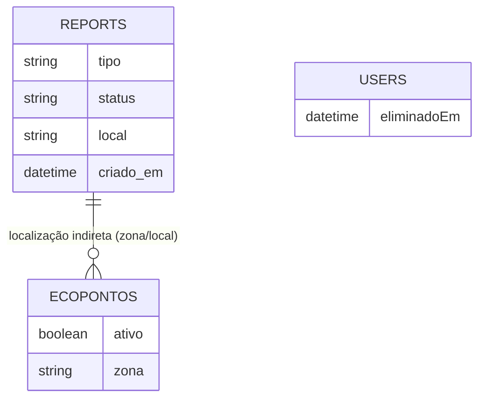
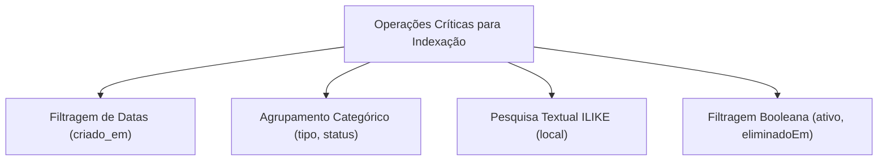

# Indexing Strategy

## Table of Contents
- [[Search/Search Architecture]]
- [[Search/Analytics & Queries]]

## Estratégia de Indexação Implícita

A plataforma não utiliza um sistema de indexação invertida externo. A estratégia de indexação recai inteiramente sobre a otimização dos índices da base de dados relacional. Baseando-nos nas queries analíticas efetuadas no `AnalyticsService`, podemos inferir os campos críticos que afetam a performance do sistema e que representam a estratégia de "indexação" de dados.

> **Sources:** `apps/api/src/analytics/analytics.service.ts:L40-L124`

## Padrões de Acesso aos Dados

Para garantir que a geração dos KPIs e métricas seja eficiente, os seguintes padrões de acesso aos dados são os mais relevantes do ponto de vista de indexação:

1. **Agrupamentos Temporais:**
   As queries efetuam agrupamentos e extrações frequentes (ex: `EXTRACT(YEAR FROM "criado_em")`) e filtragens por intervalo de datas. O campo `criado_em` da entidade de reportes é crítico para estas operações.
   
2. **Filtragem por Estado e Tipo:**
   O campo `status` é frequentemente utilizado em cláusulas `WHERE` (ex: `WHERE status = 'RESOLVIDO'`), tal como o `tipo` é usado para agregações do tipo `GROUP BY`.
   
3. **Pesquisa Textual e Operadores Lógicos:**
   A associação de reportes a zonas recorre a uma correspondência textual usando o operador `contains` insensível a maiúsculas no campo `local`. Operações deste género podem resultar em *full table scans* caso não existam índices otimizados (como índices trigrama no PostgreSQL) para suportar o `ILIKE` inerente a essa consulta.
   
4. **Campos de Estado Booleano:**
   Contagens de ecopontos dependem frequentemente de campos de ativação (ex: `ativo = true`).

> **Sources:** `apps/api/src/analytics/analytics.service.ts:L74-L76` · `apps/api/src/analytics/analytics.service.ts:L99-L100`

---
*[[index|← Back to Index]] · Generated by repowiki*
