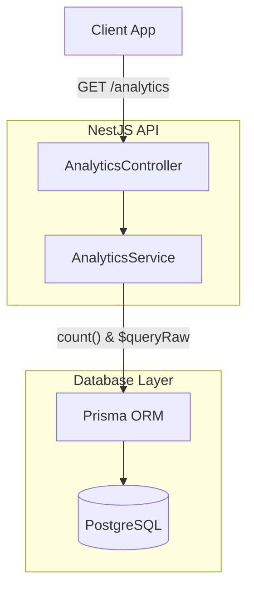
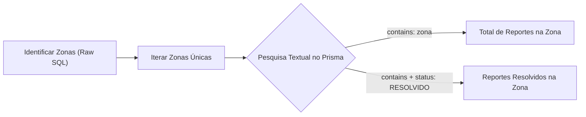

# Search Architecture

## Table of Contents
- [[Search/Analytics & Queries]]
- [[Search/Indexing Strategy]]

## Arquitetura de Pesquisa e Filtragem

No contexto da agregação de dados e estatísticas no Ecobairro, a arquitetura de "pesquisa" baseia-se diretamente na camada da base de dados relacional (PostgreSQL), utilizando as funcionalidades de filtragem e processamento do Prisma ORM.

Não existe um motor de busca Full-Text externo (como ElasticSearch ou Meilisearch) para esta funcionalidade. Em vez disso, a lógica de procura assenta em queries construídas diretamente sobre as tabelas da aplicação.

> **Sources:** `apps/api/src/analytics/analytics.controller.ts:L14-L17` · `apps/api/src/analytics/analytics.service.ts:L16-L21`

## Mecanismos de Pesquisa Textual

Um dos casos de uso de pesquisa no sistema de analytics é a correspondência de nomes de zonas reportadas. O sistema descobre todas as zonas com ecopontos ativos e, em seguida, efetua uma pesquisa textual na tabela de reportes para contar quantos reportes pertencem a cada zona.

Esta procura é realizada recorrendo ao operador `contains` do Prisma, com o modo configurado para ignorar maiúsculas/minúsculas (`mode: 'insensitive'`), atuando sobre o campo `local`.

> **Sources:** `apps/api/src/analytics/analytics.service.ts:L93-L103`

---
*[[index|← Back to Index]] · Generated by repowiki*
