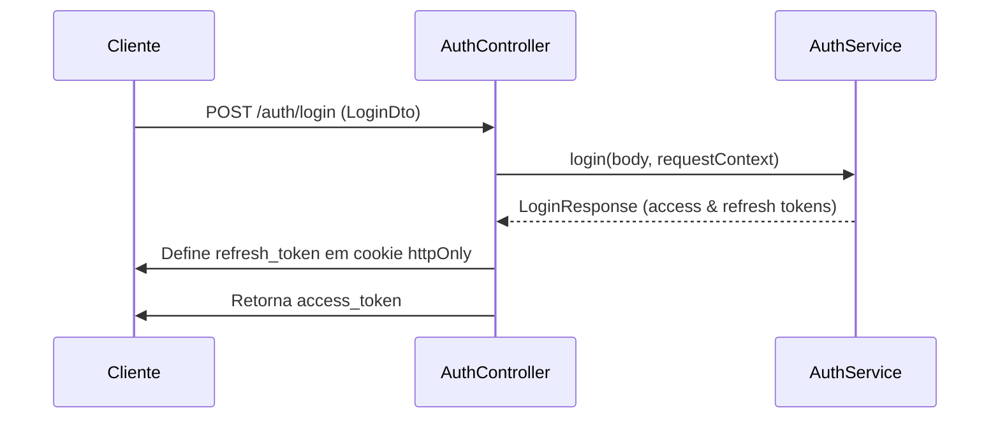
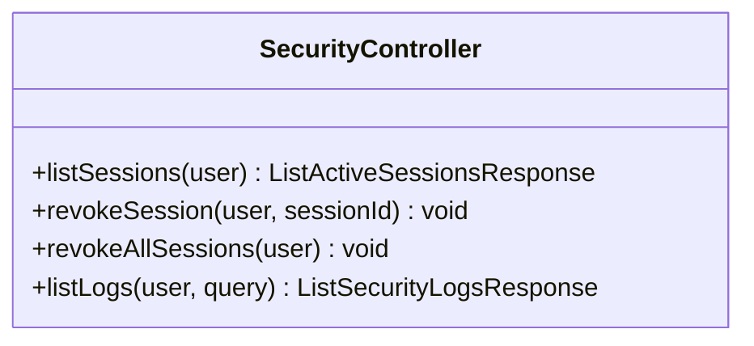

# Authentication Flow

## Table of Contents
- [[Security/RBAC & Permissions]]
- [[Security/Two-Factor Authentication]]

## Visão Geral da Autenticação

A aplicação implementa um sistema de autenticação robusto baseado em tokens JWT, complementado com um mecanismo seguro de `refresh_token`. A gestão de rotas de autenticação é feita pelo `AuthController`, que expõe os endpoints necessários para o registo, início de sessão, verificação de e-mail e recuperação de palavra-passe.

O início de sessão (`/auth/login`) e a validação de duplo factor (`/auth/verify-2fa`) estão protegidos contra ataques de força bruta através de rate limiting (`@Throttle`), permitindo um máximo de 10 tentativas a cada 15 minutos.

> **Sources:** `apps/api/src/auth/auth.controller.ts:L39-L53`

## Gestão de Sessões

Após a autenticação, os tokens de atualização (`refresh_token`) são enviados para o cliente através de cookies com as flags `httpOnly`, `secure` (em ambiente de produção), e `sameSite: 'strict'`, mitigando vulnerabilidades como XSS e CSRF. Estes cookies têm uma validade de 7 dias.

O sistema também permite a gestão ativa das sessões do utilizador através do `SecurityController`. Os utilizadores autenticados podem:
- Listar todas as suas sessões ativas (incluindo endereços de IP e User-Agent).
- Revogar sessões individuais.
- Revogar todas as sessões simultaneamente, o que também interage com o serviço de segurança para invalidar acessos globais.

> **Sources:** `apps/api/src/auth/auth.controller.ts:L132-L139` · `apps/api/src/security/security.controller.ts:L45-L80`

## Histórico de Auditoria

A componente de segurança regista as atividades relevantes da conta do utilizador e permite a sua consulta paginada através do endpoint `/security/logs`. Os registos (`ListSecurityLogsResponse`) expõem detalhes do evento (ex: IP, User-Agent, e data de criação).

> **Sources:** `apps/api/src/security/security.controller.ts:L84-L108`

---
*[[index|← Back to Index]] · Generated by repowiki*
