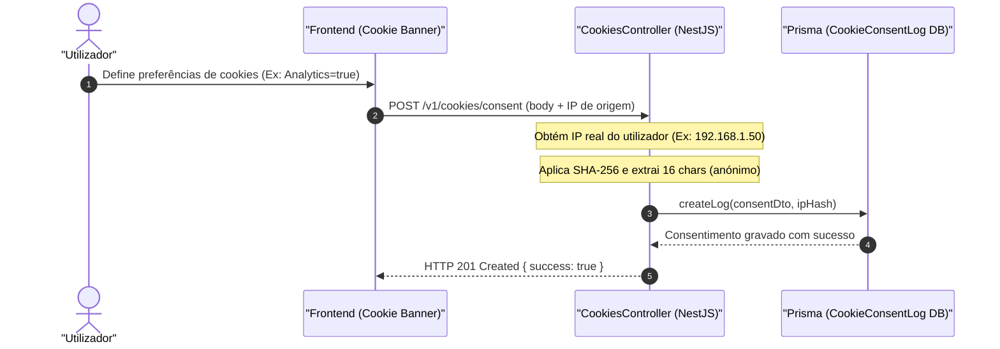

# GDPR and Cookie Compliance

## Table of Contents
- [[Security/JWT and Session Control]]
- [[Security/Two-Factor Auth Flow]]
- [[Security/Security Logs Auditing]]
- [[Security/GDPR and Cookie Compliance]]

## Visão Geral

O ecobairro foi concebido em conformidade com o Regulamento Geral sobre a Proteção de Dados (RGPD) da União Europeia. O sistema implementa uma gestão rigorosa de consentimento de cookies e tratamento de dados pessoais, assegurando que nenhum dado pessoal não essencial é armazenado ou rastreado sem o consentimento explícito e auditável do utilizador.

A conformidade com o RGPD divide-se em duas vertentes:
1. **Consentimento Global de Termos de Serviço e Privacidade**: Registado ao nível do perfil do utilizador (`rgpdAccepted` em `CidadaoPerfil`).
2. **Consentimento de Cookies de Rastreio e Preferências**: Registado ao nível de dispositivo e sessão, com auditoria anonimizada na base de dados (`CookieConsentLog`).

---

## Tipos de Cookies Utilizados

### 1. Cookies Estritamente Necessários (Essenciais)
Cookies utilizados estritamente para o correto funcionamento técnico da aplicação, estando dispensados de consentimento prévio nos termos da Diretiva ePrivacy.
* **`refresh_token`**: Cookie HTTP-only, secure e sameSite=strict, gerido pelo controlador de autenticação para manter a sessão ativa sem expor credenciais no frontend.

### 2. Cookies Opcionais (Sujeitos a Consentimento)
Cookies que dependem da ativação expressa do utilizador no banner de cookies do frontend:
* **Preferências (`preferences`)**: Personalização da interface e persistência de definições locais.
* **Analítica (`analytics`)**: Recolha de métricas de desempenho e estatísticas agregadas de utilização.
* **Marketing (`marketing`)**: Eventuais integrações de divulgação ou campanhas direcionadas.

---

## O Fluxo de Registo de Consentimento Anonimizado

Para fins de auditoria junto dos reguladores de proteção de dados, o ecobairro regista o consentimento dado a partir do endpoint `POST /v1/cookies/consent`. No entanto, a recolha de endereços IP diretos constitui processamento de PII (Personally Identifiable Information).

Para mitigar este risco, o controlador executa uma **anonimização criptográfica irreversível do IP** antes de o gravar:
1. O endereço IP em texto limpo do utilizador é lido a partir do pedido (`req.ip` ou `req.connection.remoteAddress`).
2. O IP é processado com o algoritmo SHA-256.
3. É extraído um fragmento de 16 caracteres do hash resultante (`ipHash`).
4. Apenas este fragmento anonimizado é guardado na base de dados para garantir auditoria mantendo a privacidade total do cidadão.

---

## Modelo de Dados do Registo de Consentimento (`CookieConsentLog`)

O modelo `CookieConsentLog` mapeia as preferências recolhidas de cada utilizador ou visitante anónimo:

* **id**: UUID gerado de forma automática na tabela.
* **deviceId**: Identificador exclusivo gerado no lado do cliente (browser) para agrupar consentimentos dados pelo mesmo dispositivo físico, mesmo que sem autenticação iniciada.
* **userId**: UUID opcional e anulável (`String?`). Associa o registo de consentimento a uma conta de utilizador se este estiver autenticado no momento.
* **analytics / marketing / preferences**: Booleans que representam o estado exato de aceitação de cada categoria de cookies.
* **ipHash**: String contendo o hash parcial de 16 caracteres do endereço IP do utilizador.
* **criadoEm**: Data e hora exata do registo de consentimento.

A tabela possui índices compostos (`@@index([deviceId])` e `@@index([userId])`) para otimizar pesquisas de validação do consentimento ativo.

---

## Métodos do CookiesController

* `createConsentLog(createLogDto: CreateCookieLogDto, req: Request)`
  * Captura o pedido de consentimento enviado pelo cliente.
  * Realiza a anonimização criptográfica do IP (`ipHash`).
  * Persiste o registo no banco de dados invocando o serviço `CookiesService`.

> **Sources:** apps/api/src/cookies/cookies.controller.ts:L11-L21, apps/api/prisma/schema.prisma:L297-L310, apps/api/prisma/schema.prisma:L105-L119

---
*[[index|← Back to Index]] · Generated by repowiki*
