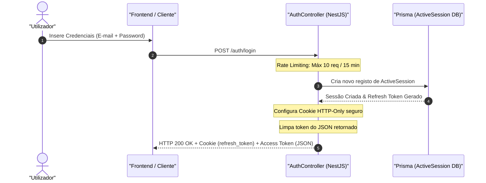

# JWT and Session Control

## Table of Contents
- [[Security/JWT and Session Control]]
- [[Security/Two-Factor Auth Flow]]
- [[Security/Security Logs Auditing]]
- [[Security/GDPR and Cookie Compliance]]

## Visão Geral

O ecobairro utiliza um mecanismo híbrido de autenticação combinando JSON Web Tokens (JWT) stateless para validação rápida de pedidos e controlo de sessões ativas stateful na base de dados. Esta abordagem garante tanto a escalabilidade da autenticação via JWT como a capacidade de auditar e revogar sessões ativas a qualquer momento pelo utilizador.

O ciclo de vida das credenciais de acesso é suportado por dois tokens principais:
1. **Access Token (JWT)**: Emitido de forma efémera para autenticação de pedidos de API.
2. **Refresh Token**: Gravado de forma segura na base de dados (`ActiveSession`) e transmitido ao cliente sob a forma de um cookie seguro e restrito.

---

## Fluxo de Autenticação e Emissão de Tokens

### 1. Início de Sessão (Login)
O processo inicia-se com o envio de credenciais válidas ao endpoint `POST /auth/login`. Para proteger o sistema contra ataques de força bruta, este endpoint está sujeito a um limitador de taxa (*rate limiter*) implementado via NestJS Throttler, com o limite padrão de **10 tentativas a cada 15 minutos**.

Após a validação bem-sucedida das credenciais:
- É gerada uma sessão ativa na base de dados (`ActiveSession`).
- O `refresh_token` é enviado ao cliente através de um cookie HTTP.
- O campo `refresh_token` no objeto de resposta JSON é intencionalmente limpo (`response.refresh_token = ''`) antes do envio para evitar a exposição acidental em logs ou pelo frontend.

#### Configuração de Segurança do Cookie:
- **HttpOnly**: Impede o acesso ao cookie via scripts de frontend (mitigando ataques XSS).
- **Secure**: O cookie só é transmitido sobre conexões encriptadas (HTTPS) em ambientes de produção.
- **SameSite (Strict)**: Protege a aplicação contra ataques de Cross-Site Request Forgery (CSRF).
- **Validade (MaxAge)**: Configurado para 7 dias (`7 * 24 * 60 * 60 * 1000` ms).

---

## Atualização de Tokens (Token Refresh)

Quando o Access Token expira, o cliente pode solicitar um novo par de tokens efetuando um pedido para `POST /auth/refresh`.

O controlador tenta extrair o `refresh_token` de duas fontes:
1. O corpo do pedido (`body.refresh_token`)
2. Os cookies do pedido (`req.cookies?.refresh_token`)

Se nenhum token for disponibilizado, é lançada uma exceção `UnauthorizedException`. Caso contrário, o token é verificado e atualizado na base de dados, renovando a validade do cookie no browser.

---

## Gestão de Sessões Ativas e Revogação

O sistema permite que o utilizador monitorize e invalide as suas sessões ativas a partir de qualquer dispositivo através do `SecurityController`.

### Listagem de Sessões
O endpoint `GET /security/sessions` devolve todas as sessões ativas ligadas à conta do utilizador através do serviço `SessionService`. Cada sessão (`ActiveSessionRecord`) expõe metadados de auditoria:
- Endereço IP de origem (`ip_address`)
- User Agent (`user_agent`)
- Datas de criação (`criado_em`) e expiração (`expires_at`)

*Nota: O frontend é responsável por comparar o ID das sessões listadas com o token atual para indicar visualmente qual é a "Sessão Atual".*

### Revogação de Sessão Individual
O utilizador pode revogar um dispositivo ou sessão específica através do endpoint `DELETE /security/sessions/:id`. O ID da sessão fornecido deve ser um UUID válido (validado pelo `ParseUUIDPipe`). Apenas o proprietário da sessão pode invocar a sua revogação.

### Revogação Global (Sair de Todos os Dispositivos)
Ao aceder a `DELETE /security/sessions`, o utilizador remove todas as suas sessões ativas da base de dados (`session.revokeAll`). Adicionalmente, o sistema executa o método `security.revokeUser(user.userId)` para invalidar imediatamente quaisquer tokens persistidos ou caches de permissões do utilizador, forçando a reautenticação em todos os clientes conectados.

---

## Assinaturas dos Métodos no Controlador

### AuthController
* `register(body: RegisterDto, req: Request): Promise<RegisterResponse>`
  * Trata do registo inicial de utilizadores, injetando o contexto do pedido.
* `login(body: LoginDto, req: Request, res: Response): Promise<LoginResponse>`
  * Autentica credenciais, inicia a sessão, define o cookie seguro do Refresh Token e devolve o Access Token.
* `refresh(body: RefreshDto, req: Request, res: Response): Promise<LoginResponse>`
  * Valida o Refresh Token ativo e emite novos tokens para o utilizador.
* `logout(user: AuthenticatedUser, res: Response): Promise<void>`
  * Invalida a sessão ativa na base de dados e remove o cookie do cliente.

### SecurityController
* `listSessions(user: AuthenticatedUser): Promise<ListActiveSessionsResponse>`
  * Devolve a lista detalhada de sessões ativas do utilizador autenticado.
* `revokeSession(user: AuthenticatedUser, sessionId: string): Promise<void>`
  * Remove e invalida uma sessão individual via ID.
* `revokeAllSessions(user: AuthenticatedUser): Promise<void>`
  * Limpa por completo a lista de sessões ativas do utilizador e revoga as suas permissões ativas.

> **Sources:** apps/api/src/auth/auth.controller.ts:L31-L88, apps/api/src/auth/auth.controller.ts:L121-L139, apps/api/src/security/security.controller.ts:L45-L81

---
*[[index|← Back to Index]] · Generated by repowiki*
