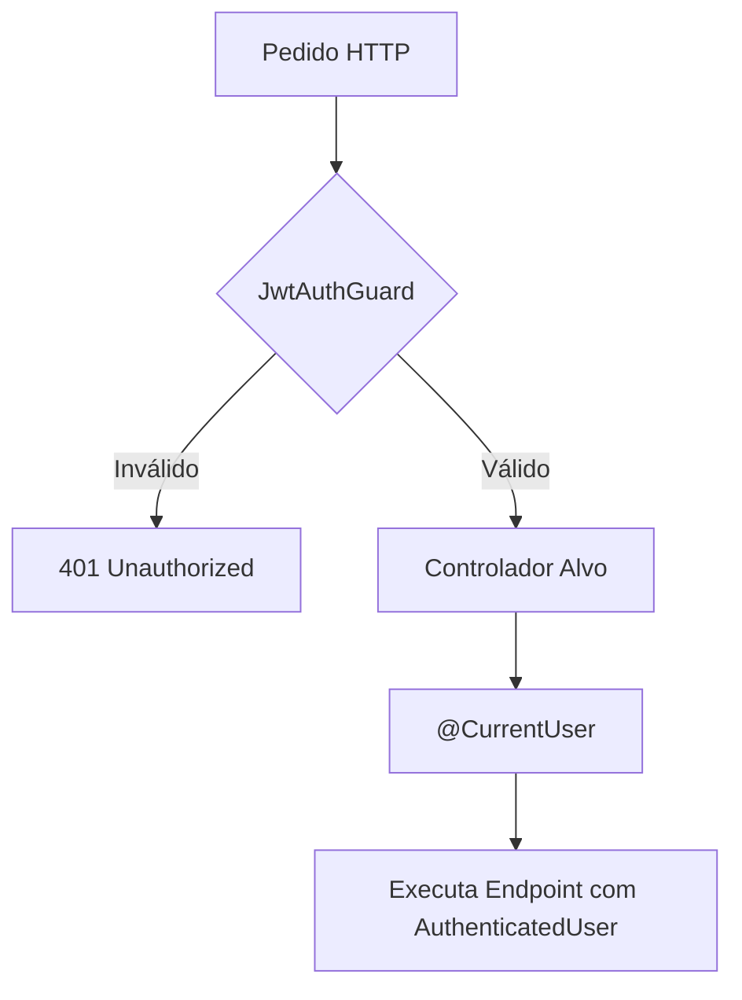

# RBAC & Permissions

## Table of Contents
- [[Security/Authentication Flow]]
- [[Security/Two-Factor Authentication]]

## Controlo de Acesso e Guards

O controlo de acesso aos endpoints protegidos da aplicação assenta na verificação de identidade baseada em JWT através do `JwtAuthGuard`. Embora a lógica granular de papéis (Role-Based Access Control) possa ser implementada na camada de serviço, a nível dos controladores analisados, a segurança foca-se em assegurar que apenas utilizadores com sessões válidas e autenticadas conseguem aceder aos recursos.

Os recursos privados e sensíveis, como a gestão de autenticação de dois fatores (`TwoFactorController`) e histórico de acessos (`SecurityController`), usam globalmente o decorador `@UseGuards(JwtAuthGuard)`. 

> **Sources:** `apps/api/src/auth/auth.controller.ts:L91-L94` · `apps/api/src/auth/two-factor.controller.ts:L33-L35` · `apps/api/src/security/security.controller.ts:L29-L31`

## RBAC ao nível do service (papéis)

O `JwtAuthGuard` só valida o token; a autorização por papel é feita na camada de
serviço através de *asserts* que leem `AuthenticatedUser.role` (`UserRole` em
MAIÚSCULAS: `CIDADAO`/`OPERADOR`/`GESTOR`/`ADMIN`). Padrões em uso:

- `AdminService.assertAdmin` — só `ADMIN` (gestão de utilizadores, `/admin/users/*`).
- `QuizAdminService.assertManager` — `GESTOR` **ou** `ADMIN` (gestão de perguntas
  do quiz, `/admin/quiz/perguntas`); senão `403 FORBIDDEN`.
- `GamificationService.assertCitizen` — só `CIDADAO` (jogar o quiz, opt-in).

Vantagem: a regra fica junto da lógica de negócio e é testável sem HTTP (ver
`tests/gamification/quiz-admin.service.test.ts`, `tests/admin/admin.service.test.ts`).

> **Sources:** `apps/api/src/gamification/quiz-admin.service.ts` · `apps/api/src/admin/admin.service.ts`

## O Decorador CurrentUser

Uma vez ultrapassada a barreira de autorização do `JwtAuthGuard`, os controladores acedem aos dados do utilizador através do decorador `@CurrentUser()`. Este decorador expõe a interface `AuthenticatedUser`, garantindo acesso seguro ao identificador interno do utilizador (`userId`) para operações subsequentes (ex: listar sessões ou efetuar operações na base de dados com o `PrismaService`).

> **Sources:** `apps/api/src/auth/two-factor.controller.ts:L23-L24`

---
*[[index|← Back to Index]] · Generated by repowiki*
