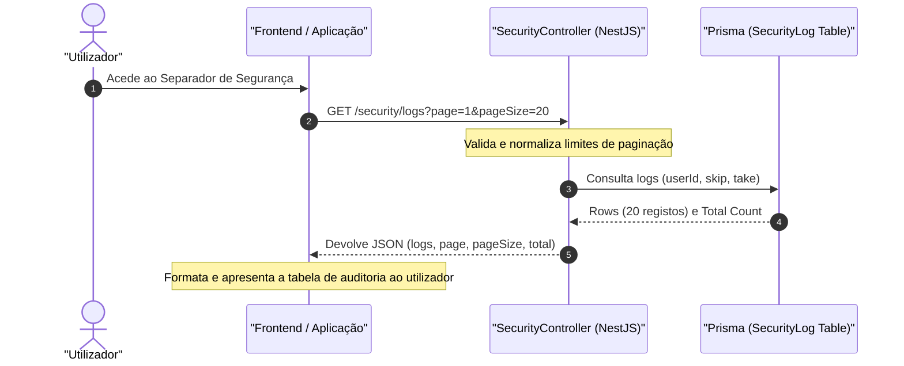

# Security Logs Auditing

## Table of Contents
- [[Security/JWT and Session Control]]
- [[Security/Two-Factor Auth Flow]]
- [[Security/Security Logs Auditing]]
- [[Security/GDPR and Cookie Compliance]]

## Visão Geral

A segurança das contas dos utilizadores no ecobairro é reforçada por um sistema centralizado de auditoria de eventos de segurança. Todos os eventos críticos, desde autenticações falhadas até alterações de credenciais, são gravados de forma indelével na base de dados (`security_logs`) para permitir auditoria posterior e deteção preventiva de intrusões.

---

## Modelo de Dados do Histórico de Segurança (`SecurityLog`)

Os registos são guardados com base no modelo `SecurityLog` mapeado na tabela `security_logs`. Cada entrada contém metadados ricos sobre a origem geográfica e de infraestrutura do pedido:

* **id**: Identificador único do registo de auditoria (UUID gerado automaticamente).
* **userId**: Referência ao utilizador associado ao evento. A relação está configurada com `onDelete: Cascade`, garantindo que os logs são expurgados se o utilizador for eliminado permanentemente da base de dados.
* **event**: Tipo de evento de segurança mapeado através do enum `SecurityEventType`.
* **ipAddress**: Endereço IP do dispositivo que originou a ação.
* **userAgent**: Identificação do navegador, sistema operativo e cliente HTTP que submeteu o pedido.
* **criadoEm**: Carimbo de data/hora preciso registado na base de dados com fuso horário (`Timestamptz(6)`).

Para garantir uma resposta rápida da API ao listar logs históricos, a tabela possui um índice composto definido nas colunas de pesquisa mais frequentes: `@@index([userId, criadoEm])`.

---

## Tipos de Eventos de Segurança (`SecurityEventType`)

O enum `SecurityEventType` define de forma estrita as ações que são elegíveis para registo no histórico de auditoria:

| Evento | Descrição |
| :--- | :--- |
| `LOGIN_SUCCESS` | Autenticação bem-sucedida do utilizador. |
| `LOGIN_FAILED` | Tentativa falhada de início de sessão (útil para analisar ataques de força bruta). |
| `PASSWORD_CHANGED` | Alteração da palavra-passe da conta. |
| `TWO_FACTOR_ENABLED` | Ativação do segundo fator de autenticação (2FA). |
| `TWO_FACTOR_DISABLED` | Desativação do segundo fator de autenticação (2FA). |
| `ACCOUNT_LOCKED` | Bloqueio temporário da conta devido a tentativas excessivas de login com erro. |
| `DEVICE_REVOKED` | Invalidação manual de uma sessão/dispositivo por parte do utilizador. |

---

## Fluxo de Gravação e Consulta de Auditoria

Qualquer ação crítica invoca de forma assíncrona o serviço de auditoria (`SecurityService.log`), de modo a não atrasar o tempo de resposta das operações principais da API.

### Endpoint de Consulta (`GET /security/logs`)
O utilizador pode visualizar o seu próprio histórico de segurança acedendo a `GET /security/logs`. O endpoint implementa paginação segura e limites estritos no volume de dados retornado:
* **page**: Página atual de consulta (normalizada para ser no mínimo `1`).
* **pageSize**: Número de registos por página, com um limite mínimo de `1` e máximo de `50` (padrão de `20` registos) para evitar sobrecarga de memória na API e na base de dados.

---

## Especificação de Métodos do Controlador

### SecurityController
* `listLogs(user: AuthenticatedUser, query: PageQuery): Promise<ListSecurityLogsResponse>`
  * Trata do processamento da query de paginação (`page`, `pageSize`), obtém os logs mapeados do utilizador atual e expõe-nos de forma segura no formato `ListSecurityLogsResponse`.

> **Sources:** apps/api/src/security/security.controller.ts:L84-L109, apps/api/prisma/schema.prisma:L36-L45, apps/api/prisma/schema.prisma:L76-L88

---
*[[index|← Back to Index]] · Generated by repowiki*
