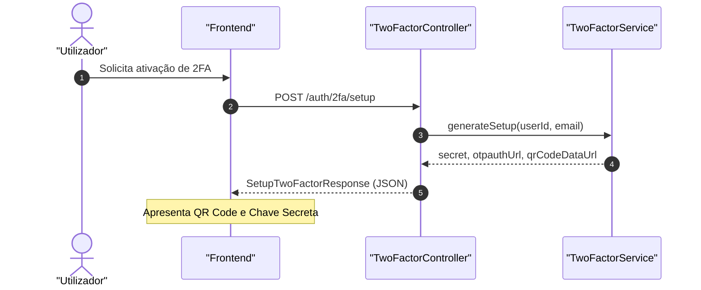
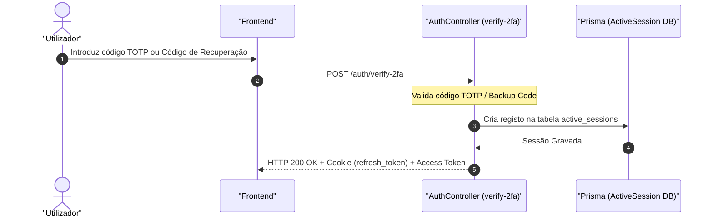

# Two-Factor Auth Flow

## Table of Contents
- [[Security/JWT and Session Control]]
- [[Security/Two-Factor Auth Flow]]
- [[Security/Security Logs Auditing]]
- [[Security/GDPR and Cookie Compliance]]

## Visão Geral

O ecobairro disponibiliza segurança adicional às contas dos utilizadores através do mecanismo de Autenticação de Dois Fatores (2FA). O sistema baseia-se em algoritmos de Time-Based One-Time Password (TOTP) em conformidade com as normas RFC 6238, utilizando aplicações de autenticação comuns (como Google Authenticator, Authy ou Microsoft Authenticator).

O fluxo de 2FA divide-se em três etapas: verificação de estado, configuração e ativação inicial, e validação no momento do login.

---

## Ciclo de Vida da Configuração do 2FA

### 1. Verificação de Estado (`GET /auth/2fa/status`)
Permite ao cliente verificar se o utilizador autenticado tem o 2FA ativo, qual o método utilizado (atualmente suportando `TOTP_APP`, `EMAIL` ou `NONE`) e a quantidade de códigos de backup ainda disponíveis para recuperação de conta.

### 2. Pedido de Configuração (`POST /auth/2fa/setup`)
Inicia o processo de vinculação de um novo dispositivo autenticador.
* O sistema valida se o 2FA já não se encontra ativo. Caso esteja, impede a operação com um erro `BadRequestException`.
* É gerado um segredo criptográfico aleatório único.
* O sistema devolve o segredo (`secret`), o URL padronizado do OTP (`otpauth_url`) e a representação visual em Base64 do QR Code (`qr_code_data_url`) para que o utilizador possa ler a configuração na aplicação de autenticação.

### 3. Ativação e Emissão de Códigos de Backup (`POST /auth/2fa/enable`)
O utilizador deve introduzir o primeiro código gerado pela sua aplicação móvel para validar que a sincronização do relógio e do segredo foi efetuada com sucesso.
* O endpoint valida o código enviado via `EnableTwoFactorDto`.
* Se o código for válido, o estado da conta é alterado para ativo na base de dados (`twoFactorEnabled = true`).
* É efetuado um registo de segurança no histórico do utilizador: `SecurityEventType.TWO_FACTOR_ENABLED`.
* São gerados e devolvidos **códigos de backup de dose única** (`backup_codes`). Estes códigos são guardados cifrados (com hash criptográfico) na base de dados e apenas são exibidos uma vez ao utilizador em texto limpo nesta resposta.

### 4. Desativação (`POST /auth/2fa/disable`)
Permite reverter a conta para autenticação de fator único.
* Exige a confirmação da palavra-passe atual do utilizador para segurança adicional (invocando o método interno `requirePassword`).
* Limpa as configurações de 2FA e códigos de backup da base de dados.
* Efetua um registo de segurança: `SecurityEventType.TWO_FACTOR_DISABLED`.

---

## Fluxo de Autenticação com 2FA Ativo

Durante o login (`POST /auth/login`), se o utilizador tiver o 2FA ativo, a API não emitirá os tokens finais na resposta inicial. Em vez disso, devolve uma resposta que sinaliza que o segundo fator de autenticação é obrigatório.

O cliente deve então capturar o código do utilizador e enviá-lo para `POST /auth/verify-2fa`:
1. Este endpoint está sujeito a um limite estrito de tentativas de login via Throttler (**máximo de 10 tentativas a cada 15 minutos**).
2. O código de 6 dígitos é submetido através do objeto `VerifyTwoFactorDto`.
3. Após validação bem-sucedida (via segredo TOTP ou através de um dos códigos de backup ativos), a sessão é criada e os tokens JWT (Access Token e cookie Refresh Token) são emitidos e configurados no cliente de forma habitual.

---

## Gestão de Códigos de Backup (Backup Codes)

Os códigos de backup destinam-se a permitir o acesso à conta em caso de perda ou avaria do dispositivo autenticador. 

### Regeneração e Revelação
Devido a restrições de segurança estritas, os códigos de backup antigos **nunca são expostos em texto limpo** após a ativação inicial (são guardados sob a forma de hashes não reversíveis na base de dados). 

Como tal, as operações de **Regeneração** (`POST /auth/2fa/backup-codes/regenerate`) e **Revelação** (`POST /auth/2fa/backup-codes/reveal`) partilham a mesma lógica:
1. Exigem a validação da palavra-passe do utilizador.
2. Invalidam todos os códigos de recuperação anteriores.
3. Geram um novo conjunto de códigos de backup limpos.
4. Devolvem o novo conjunto em texto limpo ao cliente para gravação segura.

---

## Métodos e Segurança do Controlador

### Métodos do TwoFactorController
* `status(user: AuthenticatedUser): Promise<TwoFactorStatusResponse>`
  * Consulta o estado atual da conta do utilizador (se está ativo, tipo de 2FA e número de códigos restantes).
* `setup(user: AuthenticatedUser): Promise<SetupTwoFactorResponse>`
  * Inicia a configuração do TOTP, gerando a chave secreta e os dados do código QR.
* `enable(user: AuthenticatedUser, body: EnableTwoFactorDto): Promise<EnableTwoFactorResponse>`
  * Ativa permanentemente o 2FA e emite a lista de códigos de backup iniciais.
* `disable(user: AuthenticatedUser, body: PasswordConfirmDto): Promise<{ disabled: true }>`
  * Desativa o segundo fator após validação de segurança da palavra-passe.
* `regenerate(user: AuthenticatedUser, body: PasswordConfirmDto): Promise<RegenerateBackupCodesResponse>`
  * Substitui todos os códigos de backup ativos por um conjunto novo.
* `reveal(user: AuthenticatedUser, body: PasswordConfirmDto): Promise<RevealBackupCodesResponse>`
  * Regenera e devolve novos códigos de backup (único fluxo seguro de visualização pós-ativação).

### Método Auxiliar de Segurança
* `requirePassword(userId: string, password: string): Promise<void>`
  * Valida internamente se a password enviada corresponde ao hash registado na base de dados (`passwordHash`) utilizando o algoritmo `bcrypt.compare`. Lança `UnauthorizedException` se a password for incorreta ou o utilizador inexistente.

> **Sources:** apps/api/src/auth/two-factor.controller.ts:L50-L162, apps/api/src/auth/auth.controller.ts:L74-L88

---
*[[index|← Back to Index]] · Generated by repowiki*
