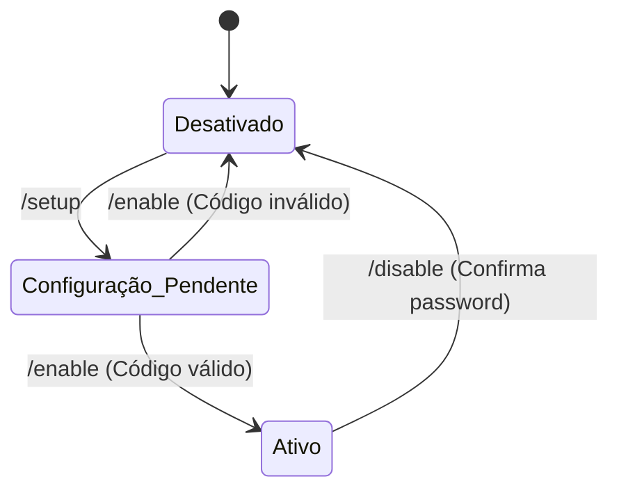
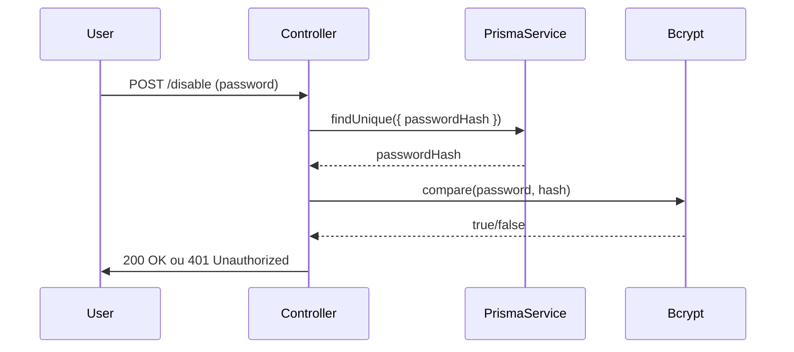

# Two-Factor Authentication

## Table of Contents
- [[Security/Authentication Flow]]
- [[Security/RBAC & Permissions]]

## Visão Geral do 2FA

A Autenticação de Dois Fatores (2FA) acrescenta uma camada adicional de segurança à conta do utilizador. As operações de gestão da 2FA estão agregadas no `TwoFactorController` (rota `/auth/2fa`), o qual está globalmente protegido pela diretiva `@UseGuards(JwtAuthGuard)`.

Através do endpoint `/status`, os clientes conseguem verificar ativamente se o 2FA está ligado para a sessão atual, qual o tipo e quantos códigos de recuperação (`backup codes`) restam disponíveis na conta.

> **Sources:** `apps/api/src/auth/two-factor.controller.ts:L50-L63`

## Configuração e Ativação

A ativação do duplo fator é um processo em duas fases:
1. **Geração (/setup):** Inicia-se validando se o utilizador já possui o 2FA ligado (o que gera um erro `BadRequestException` caso seja verdade). Se estiver inativo, o serviço produz uma chave secreta (`secret`), um URL de configuração compatível com aplicações OTP (`otpauth_url`), e um código QR (`qr_code_data_url`).
2. **Confirmação (/enable):** O utilizador introduz o código temporário gerado pela sua app autenticadora. Uma vez validado pelo sistema, a funcionalidade é marcada como ativa na base de dados, gerando adicionalmente um conjunto de códigos de recuperação (`backup_codes`) que são devolvidos no pedido.

Este evento é imediatamente registado pela auditoria interna como `SecurityEventType.TWO_FACTOR_ENABLED`.

> **Sources:** `apps/api/src/auth/two-factor.controller.ts:L65-L108`

## Gestão de Códigos de Recuperação e Desativação

Para proteger as alterações ao status de segurança, ações destrutivas (como desativar o 2FA) ou ações de risco (revelar e regenerar códigos de backup) requerem um nível de verificação acrescido.

- **Desativar (/disable):** Exige a injeção do `PasswordConfirmDto`. Apenas após validar a palavra-passe atual usando um `bcrypt.compare` contra o hash guardado, é que a desativação se efetiva e regista o evento `SecurityEventType.TWO_FACTOR_DISABLED`.
- **Revelar/Regenerar (/backup-codes/reveal ou /regenerate):** Os códigos antigos não podem ser devolvidos pois estão armazenados com hash na base de dados. Por esta razão, "revelar" códigos passa obrigatoriamente por gerar um conjunto inteiramente novo após a confirmação da password, fornecendo novamente os códigos em `plaintext` ao utilizador.

> **Sources:** `apps/api/src/auth/two-factor.controller.ts:L110-L162`

---
*[[index|← Back to Index]] · Generated by repowiki*
