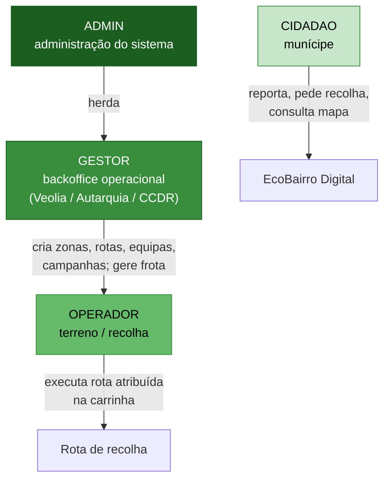

# 01 · Introdução

O **EcoBairro Digital** é uma plataforma cívica para a gestão de resíduos urbanos no concelho de **Aveiro**. Liga três mundos: o **cidadão** (consulta o mapa de ecopontos, reporta problemas, pede recolha de monos), a **operação de recolha** (gestores que planeiam e equipas de terreno que executam rotas com carrinhas) e a **rede IoT** de sensores que mantém o estado dos ecopontos atualizado mesmo onde a adoção de smartphone é baixa.

## Contexto e motivação

- **Equidade de serviço (IoT)** — em zonas com população envelhecida e <30–35% de smartphones, o estado "cheio/disponível" é assegurado por sensores IoT, não dependendo do reporte do cidadão ([[02-Requisitos/M10-Acesso-Inclusivo-IoT|RF-26]]).
- **Transparência** — o cidadão acompanha o ciclo de vida do seu report (Recebido → Resolvido) com notificações e timeline.
- **Operação eficiente** — o dashboard operacional sugere rotas por enchimento e proximidade; o gestor monta **equipas de rota** (operador + carrinha) e regista quem executou.
- **Privacidade desde o desenho** — NIF e morada são opcionais e inativos por defeito (RGPD), ver [[02-Requisitos/RNF-Nao-Funcionais#Privacidade & RGPD]].

## Glossário de papéis

O controlo de acessos (RBAC, [[02-Requisitos/RNF-Nao-Funcionais#Segurança|RNF-SEG-02]]) assenta em **quatro papéis**. Esta é a correção central face a versões anteriores da documentação, onde "Operador" designava — erradamente — trabalho de **gestão de backoffice**, e onde o **operador de terreno** e a **frota** não tinham formulação.

| Papel | É | Faz | Substitui (docs antigos) |
|-------|---|-----|--------------------------|
| **`CIDADAO`** | Munícipe / utilizador final | Mapa, detalhe e favoritos de ecopontos; reports georreferenciados; guia e pedidos de recolha de monos; partilha de materiais; gamificação (opt-in); notificações | — |
| **`OPERADOR`** | Trabalhador de terreno / motorista de recolha | Recebe a rota e a equipa atribuídas; conduz a **carrinha**; executa a recolha; marca ecopontos visitados; inicia e conclui a rota | `OPERADOR_VEOLIA` (terreno) |
| **`GESTOR`** | Backoffice operacional (Veolia / Autarquia / CCDR) | Dashboard e KPIs; triagem e encaminhamento de reports; gestão de zonas; **planeamento de rotas**; **criação de equipas de rota**; **gestão da frota (carrinhas)**; campanhas; mensagens institucionais; **análise de dados e indicadores**; **auditoria e logs** (funções antes atribuídas a técnicos da Autarquia/CCDR) | `OPERADOR_VEOLIA` (gestão); `TECNICO_AUTARQUIA`; `TECNICO_CCDR` |
| **`ADMIN`** | Administrador do sistema | Gestão de utilizadores e perfis; gestão de ecopontos e sensores; catálogo de badges/quiz; audit log. **Herda todas as capacidades de `GESTOR`** | `ADMIN` |

### Hierarquia de papéis

## O que mudou nesta retificação

1. **Papéis** — Ficam formalizados 4 papéis no total: `CIDADAO`, `OPERADOR` (terreno), `GESTOR` (backoffice) e `ADMIN`. O antigo `OPERADOR_VEOLIA` foi desdobrado em `OPERADOR` e `GESTOR` para distinguir quem atua no terreno de quem gere o painel de administração. As funções de análise/auditoria dos antigos `TECNICO_AUTARQUIA`/`TECNICO_CCDR` foram consolidadas no `GESTOR` (backoffice Veolia / Autarquia / CCDR).
2. **Frota** — nova entidade **`Carrinha`** (veículo de recolha) gerida pelo Gestor/Admin ([[02-Requisitos/M11-Frota-Equipas|RF-28]]).
3. **Equipas de Rota** — nova entidade **`EquipaRota`** (operador + carrinha + zona + rota) criada pelo Gestor (RF-29); a `rotas_execucao` passa a ligar-se a uma equipa, não diretamente a um utilizador.
4. **Diagramas** — casos de uso, conceitos, classes e arquitetura migrados para **Mermaid** e atualizados com os novos atores e entidades.

## Ver também

- [[Home]] — índice da wiki
- [[02-Requisitos]] — requisitos detalhados
- [[03-Casos-de-Uso]] — o que cada papel pode fazer
- [[04-Modelo-de-Conceitos]] — entidades e relações
