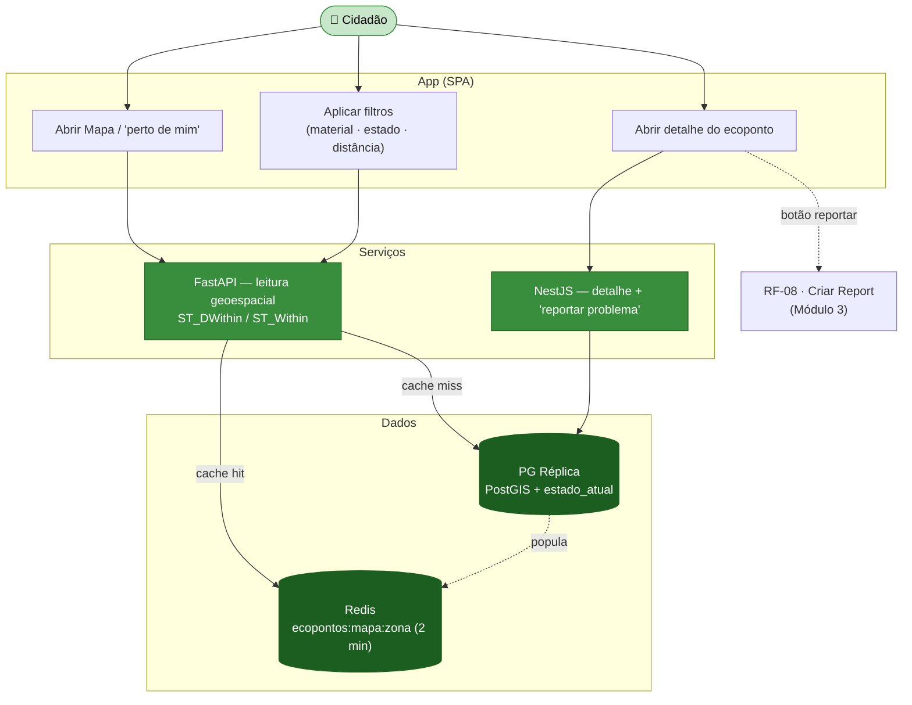
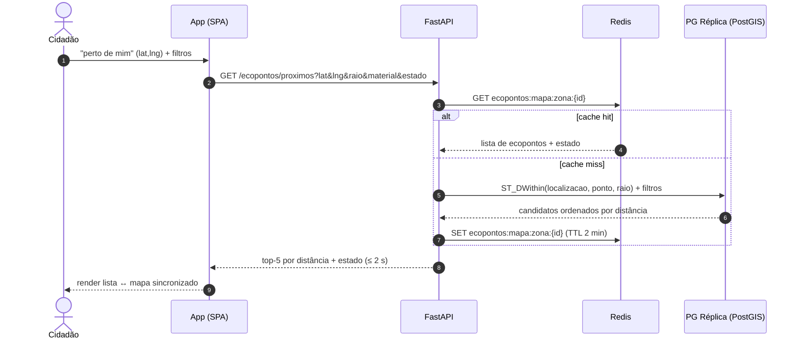
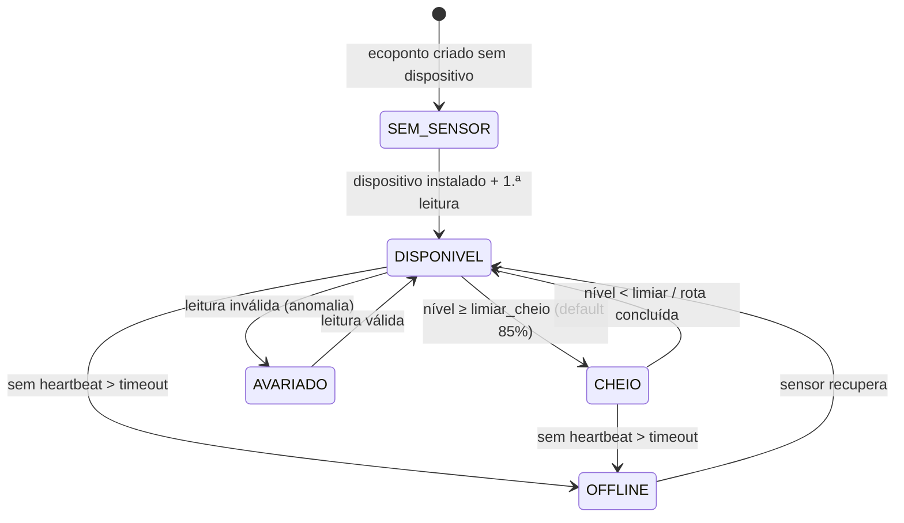

# Módulo 1 — Mapa de Ecopontos e Estado (geolocalização)

> Parte de [[02-Requisitos]] · [[Home]]. Cobre RF-01 a RF-03. Convenção de prioridade: **Alta (A) / Média (M) / Baixa (B) / Futuro (F)**.

O ponto de entrada do cidadão na app: um **mapa do concelho de Aveiro** com todos os ecopontos, a sua tipologia e o **estado em tempo real** (cheio / disponível / sem sensor), alimentado pela telemetria IoT ([[02-Requisitos/M02-IoT-Operacoes|Módulo 2]]). É o ecrã com maior exigência de performance (RNF-PERF-01/02), pelo que a leitura é servida pela **réplica + cache Redis**.

## Atores envolvidos

| Ator | Papel neste módulo |
|------|--------------------|
| 👤 **Cidadão** | Consulta o mapa, pesquisa por morada / "perto de mim", filtra e abre o detalhe do ecoponto. |
| 📡 **Sensor IoT** | Origem do estado de enchimento (indireto — ver [[02-Requisitos/M02-IoT-Operacoes|Módulo 2]]). |

## Requisitos

| RF | Prio. | Descrição | Critérios de aceitação |
|----|:----:|-----------|------------------------|
| **RF-01** | A | **Mapa de ecopontos.** Mostra todos os ecopontos do concelho com localização, tipologia (vidro/papel/embalagens/ORG/etc.) e **estado** (cheio / disponível / sem sensor). | Pesquisa por morada / "perto de mim"; lista dos **5 mais próximos**; estado sincronizado com sensores. |
| **RF-02** | A | **Detalhe do ecoponto.** Tipos aceites, horário, acessibilidade, data/hora da última leitura, botão "reportar problema". | Mostra o **timestamp** da atualização do estado. |
| **RF-03** | M | **Filtrar e navegar.** Filtros por material, estado e distância; iteração lista↔mapa. | ≥2 filtros aplicados em **<2 s** (RNF-PERF-02). |

## Fluxograma — consulta do mapa e detalhe

## Fluxo crítico — "5 ecopontos mais próximos" (RF-01) e filtros <2 s (RF-03)

## Ciclo de vida — estado do ecoponto (visível no mapa)

O estado mostrado deriva do pipeline IoT ([[02-Requisitos/M02-IoT-Operacoes|Módulo 2]]); aqui representa-se o que o cidadão vê.

## Regras de negócio

- **Estado servido por cache** — o estado de cada ecoponto é lido de `Redis` (`ecoponto:{id}` / `ecopontos:mapa:zona:{id}`) para cumprir o arranque <2 s e o primeiro render do mapa ≤3 s em 4G (RNF-PERF-01). O *miss* recorre à **réplica** PostGIS.
- **Proximidade** — `ST_DWithin(localizacao, ponto_ref, raio)` sobre índice GIST; a lista dos 5 mais próximos é ordenada por `ST_Distance`.
- **"Sem sensor" ≠ "Offline"** — ecoponto sem dispositivo apresenta-se como **SEM_SENSOR** (cinzento); um com dispositivo mas sem heartbeat recente é **OFFLINE** com data/hora da última leitura (RNF-CONF-02).
- **Ponte para reports** — o botão "reportar problema" do detalhe abre o fluxo de RF-08 já com `ecoponto_id` e geolocalização pré-preenchidos ([[02-Requisitos/M03-Reports|Módulo 3]]).

## Ver também

- [[03-Casos-de-Uso]] — pacote *Mapa e Ecopontos*
- [[02-Requisitos/M02-IoT-Operacoes|Módulo 2 — Sensores IoT]] · [[02-Requisitos/M03-Reports|Módulo 3 — Reports]]
- [[models/Ecopontos, Zonas, Badges e Quiz/Init|Domínio Ecopontos, Zonas, Badges e Quiz]]
- [[06-Arquitetura]] · [[07-Modelo-de-Dados]]
