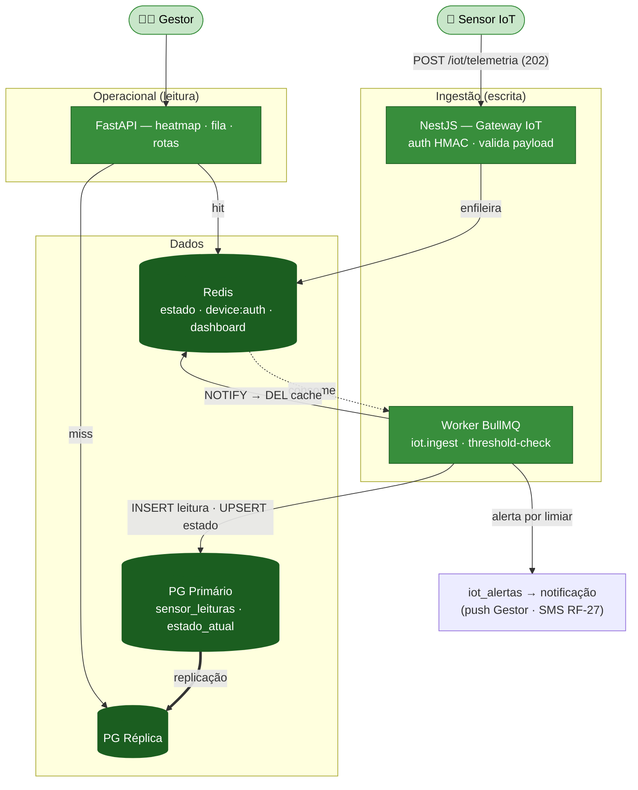
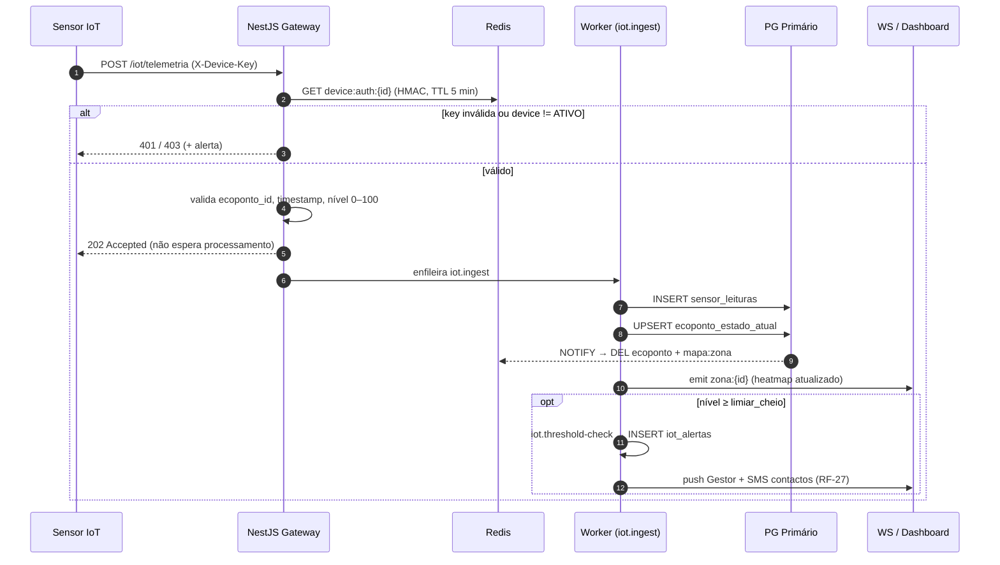
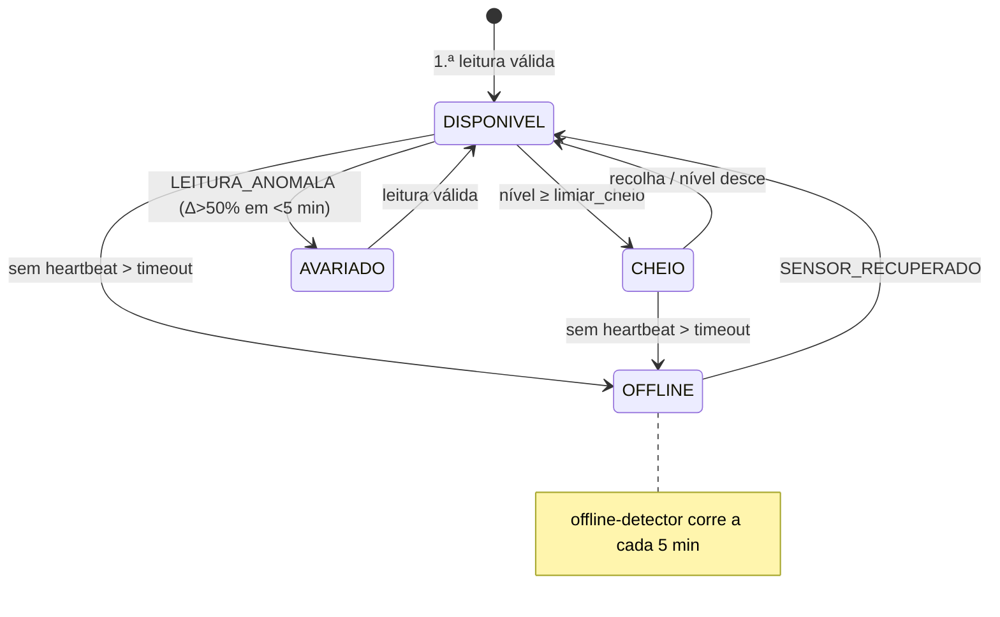

# Módulo 2 — Sensores IoT e Operações (entidades gestoras)

> Parte de [[02-Requisitos]] · [[Home]]. Cobre RF-04 a RF-07. Convenção de prioridade: **Alta (A) / Média (M) / Baixa (B) / Futuro (F)**.

O motor de dados em tempo real: recebe **telemetria de enchimento** dos sensores, atualiza o estado dos ecopontos e oferece ao **Gestor** um dashboard operacional com mapa de calor, alertas por limiar e **sugestão de rotas**. — os casos de gestão passaram do antigo "Operador" para **Gestor**. O detalhe técnico do pipeline vive em [[models/IoT e Dispositivos/Init|Domínio IoT]].

## Atores envolvidos

| Ator | Papel neste módulo |
|------|--------------------|
| 📡 **Sensor IoT** | Envia telemetria (RF-04). Ator de sistema, autenticado por API key (HMAC). |
| 🧑‍💼 **Gestor** | Usa o dashboard operacional, gere zonas e planeia rotas (RF-05, RF-06). |
| 🛡️ **Admin** | Herda o Gestor; configura limiares e dispositivos. |

## Requisitos

| RF         | Prio. | Descrição                                                                                                                                                    | Critérios de aceitação                                                                                   |                |
| ---------- | :---: | ------------------------------------------------------------------------------------------------------------------------------------------------------------ | -------------------------------------------------------------------------------------------------------- | -------------- |
| **RF-04**  |   A   | **Ingestão de telemetria.** Recebe leituras de nível/estado dos sensores e associa-as ao ecoponto.                                                           | Leituras com **timestamp e origem**; **rejeita** leituras sem ID de ecoponto.                            |                |
| **RF-05**  |   A   | **Dashboard operacional (Gestor).** Mapa de calor de enchimento, alertas por limiar, fila de prioridades e **sugestão de rotas** (enchimento + proximidade). | Exportação CSV/XLSX; **registo de quem planeou/executou** a rota — ver [[02-Requisitos/M11-Frota-Equipas | RF-29/RF-30]]. |
| **RF-06**  |   M   | **Gestão de zonas operacionais (Gestor).** Administração de "zonas" (também usadas no anti-spam de reports).                                                 | Cada ecoponto pertence a **1 zona**; alteração **mantém histórico**.                                     |                |
| **RF-07**  |   F   | **Controlo de acesso/NFC.** Preparar entidade "dispositivo de acesso" (NFC/cartão) — modelo holandês.                                                        | **Sem ativação nesta fase.**                                                                             |                |

## Fluxograma — ingestão e dashboard operacional

## Fluxo crítico — telemetria → estado (RF-04, ≤ 60 s)

## Ciclo de vida — estado do ecoponto (pipeline IoT)

## Regras de negócio

- **Rejeição sem ecoponto (RF-04)** — payload sem `ecoponto_id` → `400`; a leitura é guardada com `valida=false` apenas para auditoria.
- **Autenticação O(1)** — com ~10.000 msg/min, a auth do dispositivo é cacheada em `device:auth:{id}` (TTL 5 min) para evitar uma query PG por leitura; invalidada na rotação de API key.
- **Limiar configurável por zona** — `zonas.alertas_config.limiar_cheio` (default 85%) determina a transição para `CHEIO`. Bateria <20% gera `BATERIA_FRACA`.
- **Histórico de zonas (RF-06)** — alterar a zona de um ecoponto mantém registo; cada ecoponto pertence sempre a exatamente **1 zona** (base do anti-spam de reports, [[02-Requisitos/M03-Reports|Módulo 3]]).
- **NFC (RF-07)** — apenas modelação preparatória; **sem endpoints ativos** nesta fase.

## Ver também

- [[03-Casos-de-Uso]] — pacote *IoT / Telemetria* e *Backoffice Operacional*
- [[02-Requisitos/M01-Mapa-Ecopontos|Módulo 1]] · [[02-Requisitos/M10-Acesso-Inclusivo-IoT|Módulo 10]] · [[02-Requisitos/M11-Frota-Equipas|Módulo 11]]
- [[models/IoT e Dispositivos/Init|Domínio IoT — pipeline completo]]
- [[06-Arquitetura]] · [[07-Modelo-de-Dados]]
