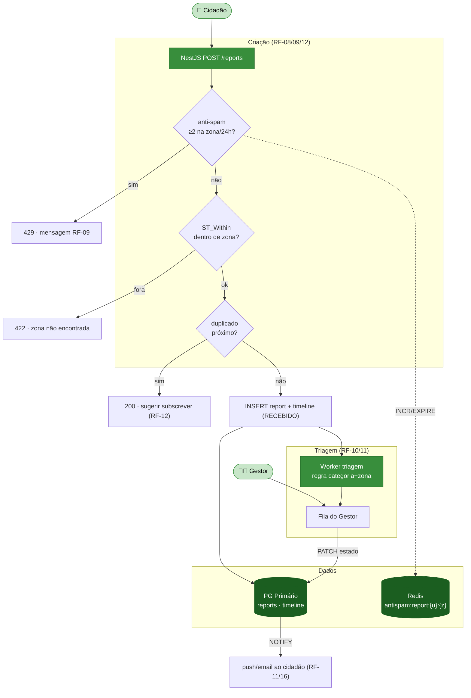
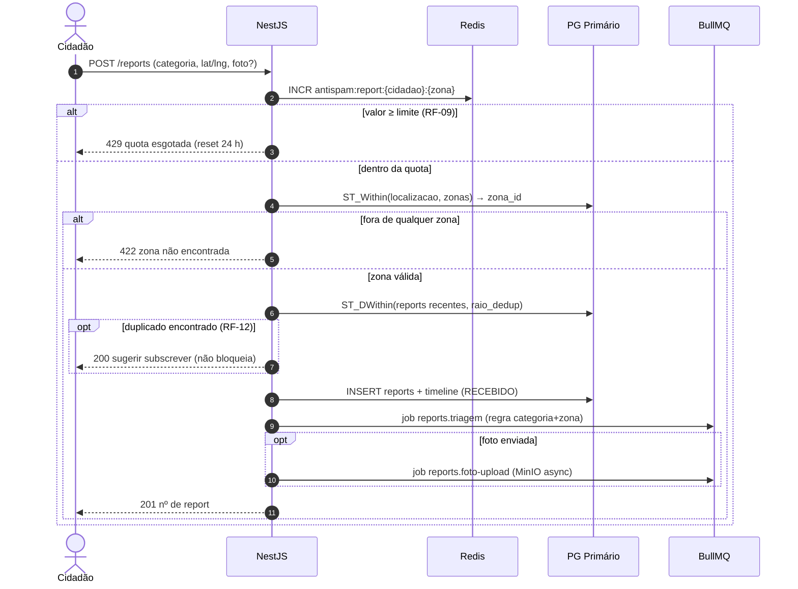
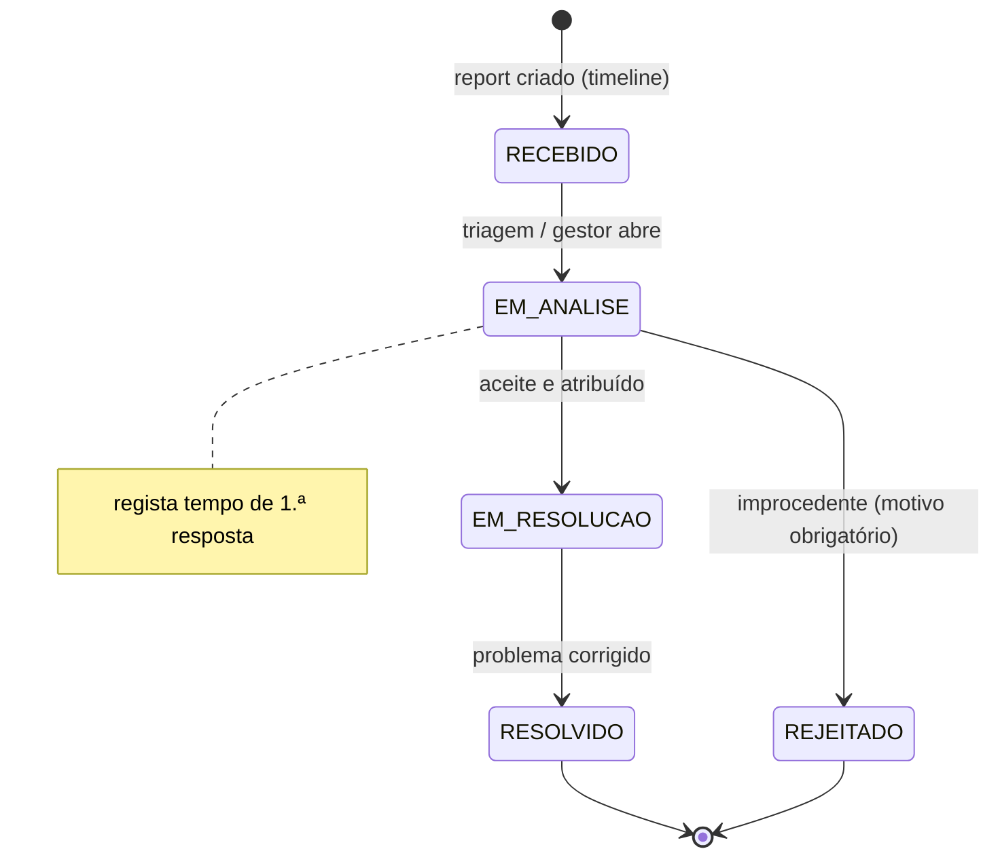

# Módulo 3 — Sistema de Reports (cidadão ↔ entidade)

> Parte de [[02-Requisitos]] · [[Home]]. Cobre RF-08 a RF-12. Convenção de prioridade: **Alta (A) / Média (M) / Baixa (B) / Futuro (F)**.

O canal de **participação cívica**: o cidadão reporta problemas georreferenciados (ecoponto cheio/partido, deposição ilegal, odores…), a entidade tria e resolve, e o cidadão acompanha o estado com **transparência total**. Inclui salvaguardas contra abuso (anti-spam por zona) e contra ruído (deteção de duplicados). Detalhe de endpoints e schema em [[models/Reports, Recolhas, Comunicação e Operacional/reports/1.4 Endpoints REST — Reports|Endpoints REST — Reports]].

## Atores envolvidos

| Ator | Papel neste módulo |
|------|--------------------|
| 👤 **Cidadão** | Cria reports, subscreve duplicados, acompanha o estado e a timeline. |
| 🧑‍💼 **Gestor** | Tria, encaminha, atribui e avança o estado dos reports (RF-10/RF-11). |
| 🚚 **Operador** | Pode receber reports atribuídos para resolução em terreno. |

## Requisitos

| RF         | Prio. | Descrição                                                                                            | Critérios de aceitação                                                          |
| ---------- | :---: | ---------------------------------------------------------------------------------------------------- | ------------------------------------------------------------------------------- |
| **RF-08**  |   A   | **Criar report georreferenciado.** Geolocalização, categoria, foto opcional, descrição.              | Geotag automático com **override**, preview, confirmação.                       |
| **RF-09**  |   A   | **Limite anti-spam por zona.** **Máx. 2 reports por zona por utilizador / 24 h.**                    | 3.ª tentativa mostra mensagem; **reseta em 24 h**.                              |
| **RF-10**  |   A   | **Triagem e encaminhamento (Gestor).** Reports entram numa fila gerida pelo Gestor.                  | Regra de despacho **configurável** por categoria+zona.                          |
| **RF-11**  |   A   | **Estado e transparência.** Estados: Recebido → Em análise → Em resolução → Resolvido / Rejeitado.   | Notificações ao cidadão; **timeline visível**; tempo de 1.ª resposta registado. |
| **RF-12**  |   M   | **Deteção de duplicados.** Sugere junção se existir report da mesma categoria num raio configurável. | Convida a **"subscrever"** o existente.                                         |

## Fluxograma — criar e tratar um report

## Fluxo crítico — pipeline `POST /reports` (R1)

## Ciclo de vida — estado do report (RF-11)

## Regras de negócio

- **Anti-spam O(1) (RF-09)** — `Redis INCR antispam:report:{cidadao_id}:{zona_id}` com `EXPIREAT` a +24 h; à 3.ª tentativa devolve `429`. Não vai ao PostgreSQL no *hot path*.
- **Zona obrigatória** — todo o report é encaminhado por zona (`ST_Within`); ponto fora de qualquer zona devolve `422`.
- **Duplicados não bloqueiam (RF-12)** — a sugestão de subscrição é informativa (`200`); o cidadão pode prosseguir. A subscrição incrementa `num_subscricoes` no report-pai.
- **Transparência (RF-11)** — cada transição escreve em `reports_timeline` e emite `NOTIFY report_estado_updated`, que dispara notificação push/email ([[02-Requisitos/M05-Comunicacao|Módulo 5]]). Rejeição exige `motivo_rejeicao`.
- **Despacho configurável (RF-10)** — a regra `categoria + zona → entidade_responsavel` é parametrizável pelo Gestor.

## Ver também

- [[03-Casos-de-Uso]] — pacote *Reports*
- [[02-Requisitos/M01-Mapa-Ecopontos|Módulo 1]] · [[02-Requisitos/M05-Comunicacao|Módulo 5]]
- [[models/Reports, Recolhas, Comunicação e Operacional/reports/1.4 Endpoints REST — Reports|Endpoints REST — Reports]]
- [[06-Arquitetura]] · [[07-Modelo-de-Dados]]
