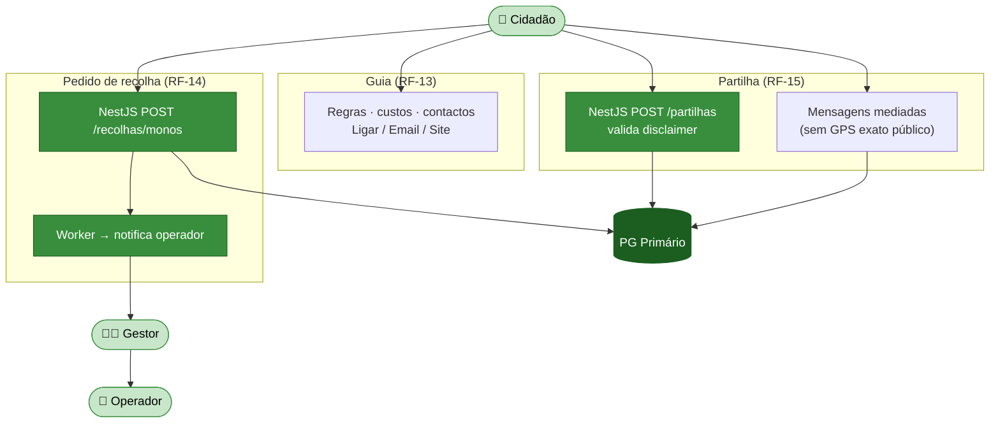
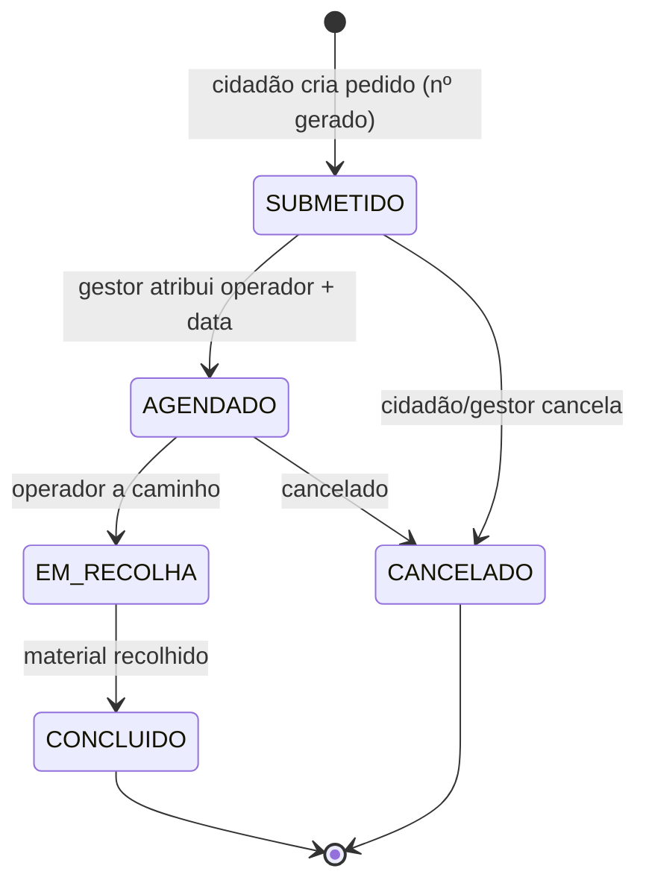

# Módulo 4 — Monos/Entulhos (informação e pedidos)

> Parte de [[02-Requisitos]] · [[Home]]. Cobre RF-13 a RF-15. Convenção de prioridade: **Alta (A) / Média (M) / Baixa (B) / Futuro (F)**.

Apoia o cidadão na gestão de **monos e entulhos**: um guia com as regras locais de Aveiro e contactos, um **pedido de recolha** que chega ao operador de terreno, e um quadro de **partilha cidadão-a-cidadão** de materiais de obra com salvaguardas legais e de privacidade.

## Atores envolvidos

| Ator | Papel neste módulo |
|------|--------------------|
| 👤 **Cidadão** | Consulta o guia, submete pedidos de recolha, publica/responde a partilhas. |
| 🚚 **Operador** | Recebe e executa o pedido de recolha em terreno (RF-14). |
| 🧑‍💼 **Gestor** | Encaminha/atribui pedidos ao operador. |

## Requisitos

| RF | Prio. | Descrição | Critérios de aceitação |
|----|:----:|-----------|------------------------|
| **RF-13** | A | **Guia de deposição de monos/entulhos.** Regras locais, locais de entrega, custos e **contactos das empresas**. | Ações rápidas **"Ligar / Email / Visitar site"**. |
| **RF-14** | M | **Pedido de recolha.** Formulário com morada, tipo/volume e foto opcional. | Gera **número de pedido** e envia ao **operador** responsável. |
| **RF-15** | M | **Partilha Cidadão-Cidadão (materiais de obra).** Quadro de anúncios para doar/ceder, **com disclaimers legais**. | Sem geolocalização exata pública por defeito; **mensagens mediadas**. |

## Fluxograma — pedido de recolha e partilha

## Ciclo de vida — pedido de recolha (RF-14)

## Regras de negócio

- **Número de pedido (RF-14)** — gerado na submissão; o pedido é encaminhado por zona ao **operador** responsável pela recolha de terreno ([[02-Requisitos/M11-Frota-Equipas|Módulo 11]]).
- **Privacidade na partilha (RF-15)** — a localização exata **não** é pública por defeito; só se mostra a zona aproximada. As mensagens entre cidadãos são **mediadas** pela plataforma (sem troca direta de contactos).
- **Disclaimers legais (RF-15)** — a publicação exige aceitação de um disclaimer (responsabilidade do cedente; materiais de obra não perigosos).
- **Guia estático com ações (RF-13)** — contactos das empresas com *deep links* `tel:` / `mailto:` / `https:`.

## Ver também

- [[03-Casos-de-Uso]] — pacote *Monos e Partilha*
- [[02-Requisitos/M11-Frota-Equipas|Módulo 11 — Operador / terreno]]
- [[models/Reports, Recolhas, Comunicação e Operacional/init|Domínio Reports, Recolhas, Comunicação e Operacional]]
- [[07-Modelo-de-Dados]]
