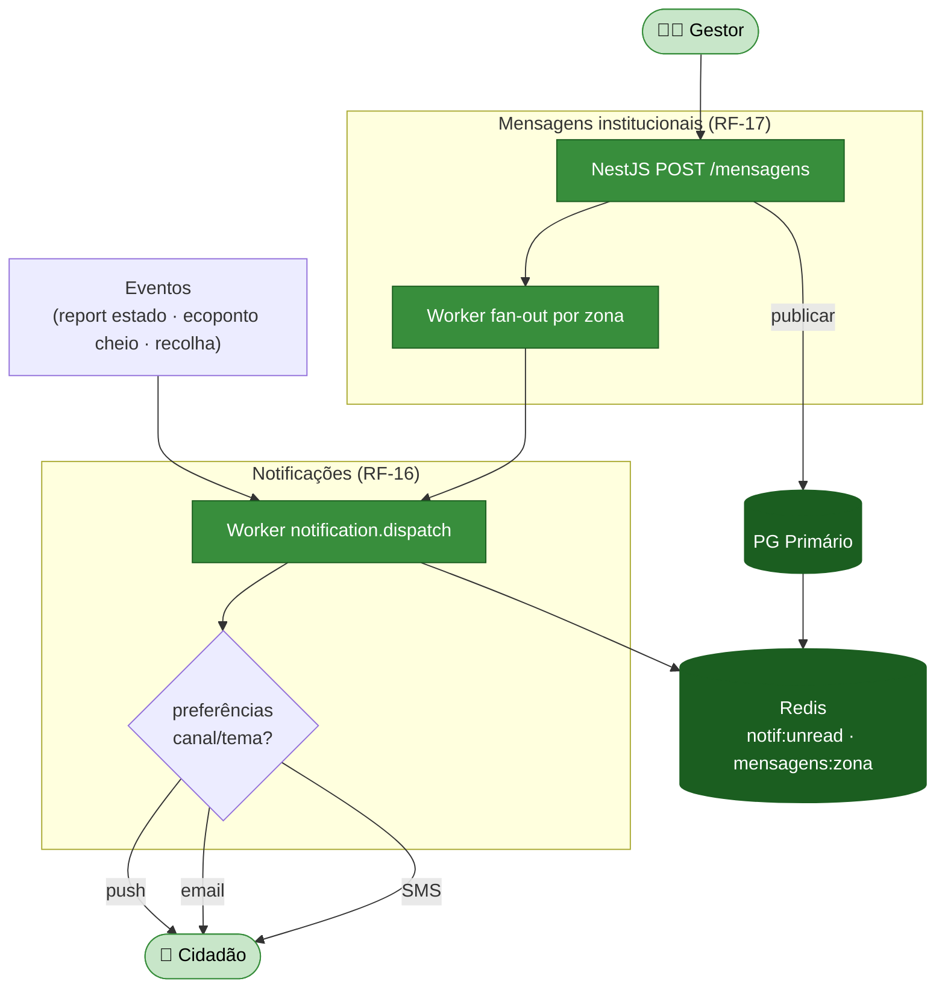
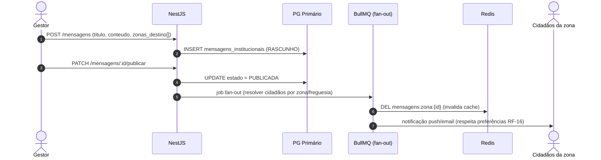

# Módulo 5 — Comunicação e Feedback

> Parte de [[02-Requisitos]] · [[Home]]. Cobre RF-16 a RF-17. Convenção de prioridade: **Alta (A) / Média (M) / Baixa (B) / Futuro (F)**.

O sistema nervoso de **comunicação** da plataforma: notificações multicanal (push/email/SMS) acionadas por eventos (estado de reports, ecopontos cheios, recolhas) e um painel de **mensagens institucionais** segmentadas por zona/freguesia, publicadas pelo Gestor. 

## Atores envolvidos

| Ator | Papel neste módulo |
|------|--------------------|
| 👤 **Cidadão** | Recebe notificações e configura preferências por canal/tema. |
| 🧑‍💼 **Gestor** | Publica mensagens institucionais segmentadas (RF-17). |

## Requisitos

| RF         | Prio. | Descrição                                                                                              | Critérios de aceitação              |
| ---------- | :---: | ------------------------------------------------------------------------------------------------------ | ----------------------------------- |
| **RF-16**  |   A   | **Notificações.** Push/email sobre estado de reports, ecopontos próximos cheios, marcações de recolha. | **Preferências por canal e tema**.  |
| **RF-17**  |   M   | **Mensagens institucionais (Gestor).** Painel de avisos (alterações de rotas, campanhas).              | **Segmentação por zona/freguesia**. |

## Fluxograma — notificações e mensagens institucionais

## Fluxo crítico — publicar mensagem institucional (RF-17)

## Regras de negócio

- **Preferências por canal e tema (RF-16)** — cada cidadão define que temas recebe e por que canal; o `notification.dispatch` filtra antes de enviar. Contagem de não-lidas em `Redis notif:unread:{id}` (TTL 5 min).
- **Segmentação (RF-17)** — a mensagem referencia `zonas_destino[]`; o fan-out resolve os destinatários por zona/freguesia. Cache `mensagens:zona:{id}` (TTL 10 min), invalidada na publicação.
- **Eventos que disparam RF-16** — transição de estado de report ([[02-Requisitos/M03-Reports|Módulo 3]]), ecoponto cheio próximo de favorito ([[02-Requisitos/M02-IoT-Operacoes|Módulo 2]]), agendamento de recolha ([[02-Requisitos/M04-Monos-Partilha|Módulo 4]]).
- **SMS** — canal reservado a alertas críticos e a contactos opt-in por zona ([[02-Requisitos/M10-Acesso-Inclusivo-IoT|Módulo 10]], RF-27).

## Ver também

- [[03-Casos-de-Uso]] — pacote *Comunicação*
- [[02-Requisitos/M03-Reports|Módulo 3]] · [[02-Requisitos/M10-Acesso-Inclusivo-IoT|Módulo 10]]
- [[models/Reports, Recolhas, Comunicação e Operacional/init|Domínio Comunicação e Operacional]]
- [[07-Modelo-de-Dados]]
