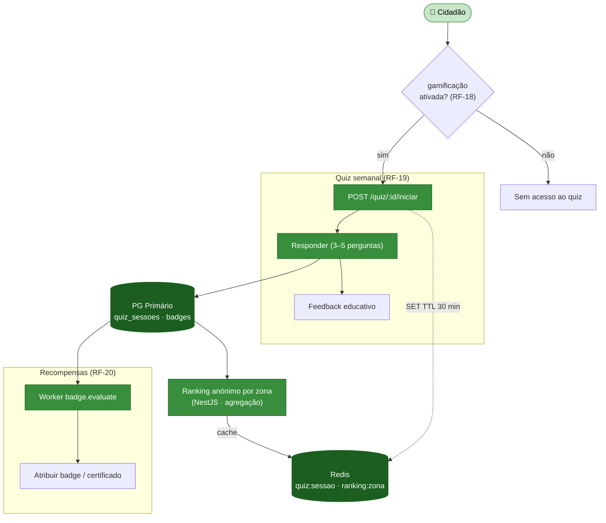
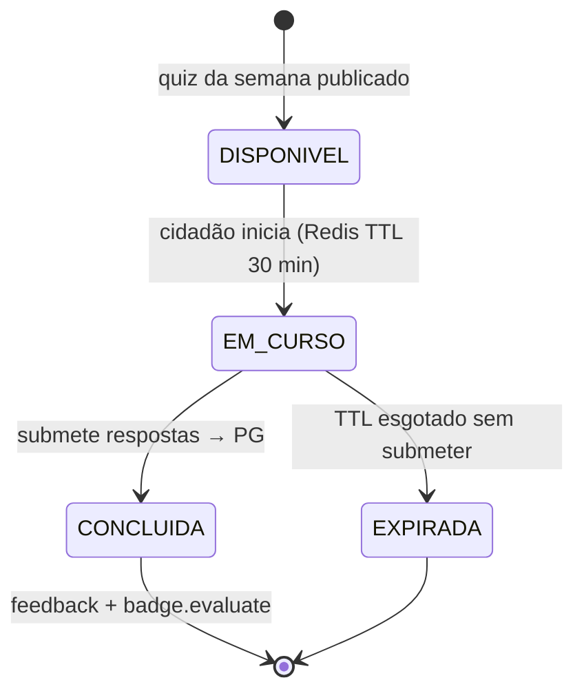

# Módulo 6 — Gamificação (opcional)

> Parte de [[02-Requisitos]] · [[Home]]. Cobre RF-18 a RF-20. Convenção de prioridade: **Alta (A) / Média (M) / Baixa (B) / Futuro (F)**.

Camada **opt-in** de educação para a separação de resíduos: um quiz semanal com feedback educativo, ranking **anónimo** por zona e recompensas simbólicas (badges/certificados). **Desativado por defeito** — adesão explícita do cidadão. Nunca envolve benefícios financeiros.

## Atores envolvidos

| Ator | Papel neste módulo |
|------|--------------------|
| 👤 **Cidadão** | Adere/abandona, joga o quiz, ganha badges, vê o ranking anónimo. |
| 🧭 **Gestor** | Gere o banco de perguntas do quiz (criar/editar/apagar). |
| 🛡️ **Admin** | Idem gestor + catálogo de badges ([[02-Requisitos/M09-Utilizadores-Perfis|Módulo 9]]). |

## Requisitos

| RF | Prio. | Descrição | Critérios de aceitação |
|----|:----:|-----------|------------------------|
| **RF-18** | M | **Opt-in de gamificação.** Aderir/abandonar. | **Desativado por defeito.** |
| **RF-19** | M | **Quiz semanal de separação.** 3–5 perguntas/semana com feedback educativo. | Ranking **anónimo** por zona. |
| **RF-20** | B | **Recompensas educativas.** Badges e certificados. | **Não** são benefícios financeiros. |

## Fluxograma — opt-in e quiz semanal

## Ciclo de vida — sessão de quiz (RF-19)

## Regras de negócio

- **Opt-in estrito (RF-18)** — `cidadao_perfis.gamificacao_optin = false` por defeito; sem adesão, os endpoints de quiz/ranking devolvem `403`. Abandonar mantém o histórico anonimizado.
- **Sessão com TTL (RF-19)** — `Redis quiz:sessao:{id}` com TTL 30 min impede respostas fora de tempo; ao submeter, a sessão é persistida em `quiz_sessoes` (PG) e a chave Redis apagada.
- **Ranking anónimo (RF-19)** — agregação por zona **sem identificadores pessoais** (RNF-PRIV-04); nunca expõe quem respondeu o quê.
- **Sem valor financeiro (RF-20)** — badges/certificados são puramente educativos; distinto das **campanhas de benefício** ([[02-Requisitos/M07-Beneficios|Módulo 7]]).

## Estado da implementação (atual)

> Código: `apps/api/src/gamification/` (+ `CLAUDE.md`) e
> `apps/web/src/routes/_layoutmain.quiz.tsx` + `apps/web/src/components/quiz/`.

**Implementado:**

- Opt-in (RF-18): `POST/DELETE /v1/gamification/optin`; `iniciar`/`responder`
  devolvem `403` (`QUIZ_OPT_IN_REQUIRED`) sem adesão.
- Quiz jogável (RF-19): `iniciar` → `responder` → resultado com feedback
  educativo por pergunta; sessão em `Redis quiz:sessao:{id}` (TTL 30 min);
  histórico em `quiz_sessoes`.
- **Perguntas aleatórias por sorteio de um banco curado** (`quiz-bank.ts`,
  seedado como pool `Quiz`). Decisão de design: em vez de quizzes fixos
  escritos por admin, o backend **sorteia N perguntas** (Fisher-Yates) do pool
  por sessão. Mantém as invariantes: exatamente 1 opção correta, `correta`
  nunca em cache/payload, feedback educativo sempre. (Sem geração por LLM/ML em
  runtime — escolha por fiabilidade, offline e testabilidade.)
- Pontuação do quiz integrada na gamificação (soma aos pontos; níveis e
  conquistas calculados dinamicamente).
- **Gestão de perguntas (GESTOR/ADMIN):** CRUD do banco via
  `/v1/admin/quiz/perguntas` (`GET`/`POST`/`PATCH`/`DELETE`) + UI em
  `apps/web/src/routes/_layoutmain.gestao-quiz.tsx`. Acesso por `assertManager`;
  valida exatamente 1 opção correta e 2-6 opções; auditado. Atua sobre o pool
  ativo único — ver [[models/Ecopontos, Zonas, Badges e Quiz/quiz/Gestão (admin)]].

**Futuro (não implementado):**

- Tabela `badges`/`cidadao_badges` + atribuição assíncrona (BullMQ) + WebSocket.
- Ranking **anónimo por zona** (hoje o ranking mostra nomes — ver RNF-PRIV-04).
- Estatísticas por pergunta e CRUD de **pools/quizzes por evento** (Q10-Q13;
  hoje a gestão é só de **perguntas** sobre o pool ativo único).
- Cache Redis do quiz atual/rankings e imagens (MinIO).

## Ver também

- [[03-Casos-de-Uso]] — pacote *Gamificação (opt-in)*
- [[02-Requisitos/M07-Beneficios|Módulo 7]] · [[02-Requisitos/M09-Utilizadores-Perfis|Módulo 9]]
- [[models/Ecopontos, Zonas, Badges e Quiz/Init|Domínio Badges e Quiz]]
- [[07-Modelo-de-Dados]]
