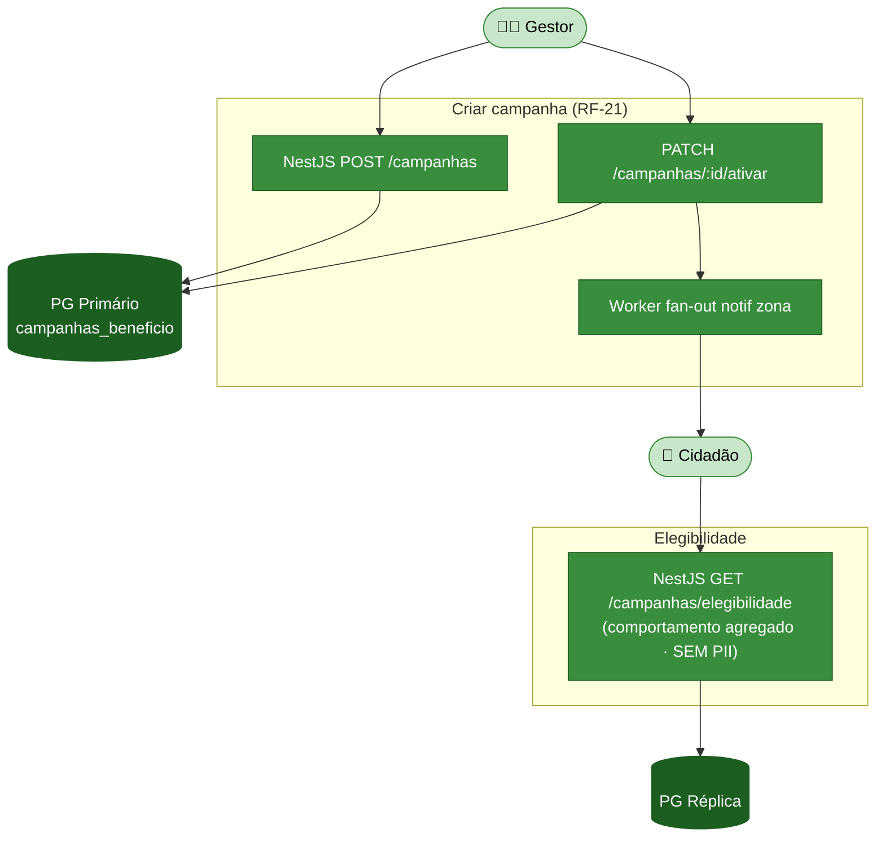
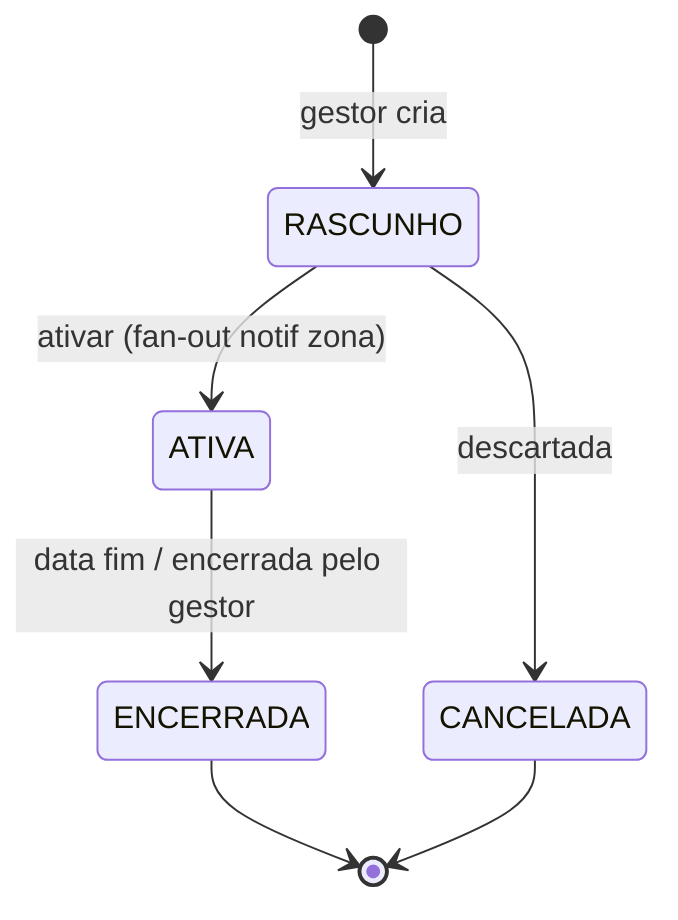

# Módulo 7 — Benefícios / recolha porta-a-porta

> Parte de [[02-Requisitos]] · [[Home]]. Cobre RF-21. Convenção de prioridade: **Alta (A) / Média (M) / Baixa (B) / Futuro (F)**.

Permite ao **Gestor** lançar **campanhas de benefício** assentes em comportamentos observáveis e **não pessoais** — sem usar NIF ou morada para *scoring*, em respeito pela minimização de dados (RGPD). 

## Atores envolvidos

| Ator | Papel neste módulo |
|------|--------------------|
| 🧑‍💼 **Gestor** | Cria e ativa campanhas; define critérios de elegibilidade não pessoais. |
| 👤 **Cidadão** | Vê campanhas da sua zona e a sua elegibilidade. |

## Requisitos

| RF | Prio. | Descrição | Critérios de aceitação |
|----|:----:|-----------|------------------------|
| **RF-21** 🔧 | M | **Campanhas de benefício (Gestor).** Campanhas baseadas em comportamentos observáveis não pessoais. | Elegibilidade clara; **sem NIF/morada** para scoring. |

## Fluxograma — criação e elegibilidade de campanhas

## Ciclo de vida — campanha de benefício (RF-21)

## Regras de negócio

- **Sem PII no scoring (RF-21)** — a elegibilidade usa **comportamentos observáveis agregados** (ex.: frequência de uso de ecopontos numa zona), nunca NIF ou morada (RNF-PRIV-01/04). O endpoint de elegibilidade lê da réplica sem expor identificadores pessoais.
- **Segmentação por zona** — a campanha é criada para uma zona e a ativação dispara fan-out de notificação ([[02-Requisitos/M05-Comunicacao|Módulo 5]]).
- **Distinto da gamificação** — benefícios podem ter valor material; o quiz/badges ([[02-Requisitos/M06-Gamificacao|Módulo 6]]) são apenas educativos.

## Ver também

- [[03-Casos-de-Uso]] — pacote *Backoffice Operacional (Gestor)*
- [[02-Requisitos/M05-Comunicacao|Módulo 5]] · [[02-Requisitos/M06-Gamificacao|Módulo 6]]
- [[models/Reports, Recolhas, Comunicação e Operacional/init|Domínio Campanhas de Benefício]]
- [[07-Modelo-de-Dados]]
