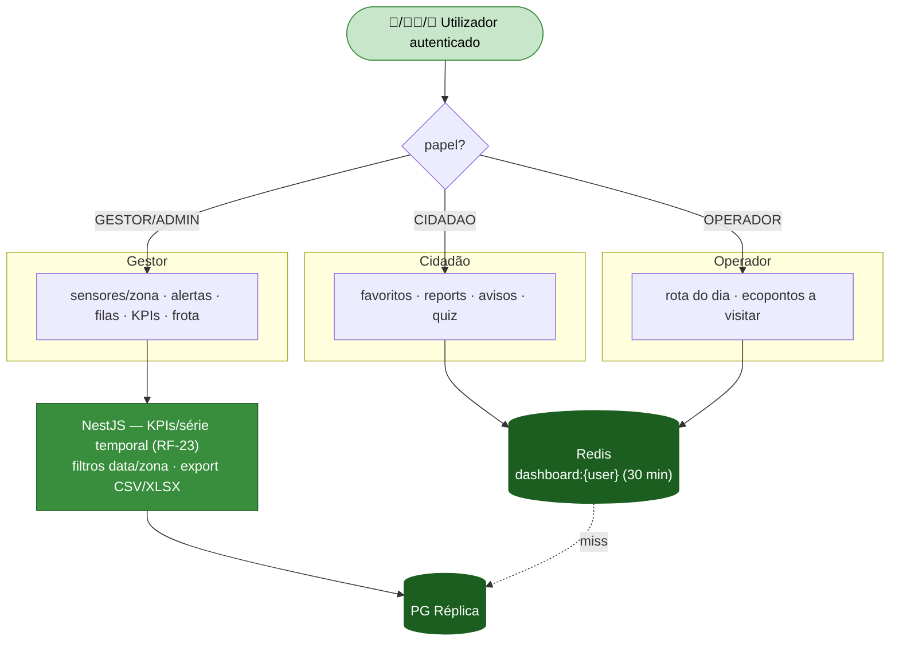

# Módulo 8 — Dashboards Personalizáveis (todos os perfis)

> Parte de [[02-Requisitos]] · [[Home]]. Cobre RF-22 a RF-23. Convenção de prioridade: **Alta (A) / Média (M) / Baixa (B) / Futuro (F)**.

Cada perfil tem um **dashboard configurável** com widgets relevantes e acesso a **KPIs com série temporal**. A composição persiste por utilizador e é servida com cache para cumprir o orçamento de performance (RNF-PERF-02).

## Atores envolvidos

| Ator | Widgets típicos |
|------|-----------------|
| 👤 **Cidadão** | Favoritos, os meus reports, avisos, quiz. |
| 🧑‍💼 **Gestor** | Sensores por zona, alertas, filas de reports, KPIs, frota. |
| 🚚 **Operador** | Rota do dia, ecopontos a visitar. |

## Requisitos

| RF | Prio. | Descrição | Critérios de aceitação |
|----|:----:|-----------|------------------------|
| **RF-22** | A | **Widgets por perfil.** Cidadão/Gestor/Operador com conjuntos próprios. | Escolher/ordenar widgets; **persistem por utilizador**. |
| **RF-23** | M | **KPIs e histórico.** Tempo médio de resolução, nº reports por categoria, % enchimento médio por zona, série temporal. | Filtros por **data/zona**; **exportação**. |

## Fluxograma — composição de dashboard por perfil

## Regras de negócio

- **Persistência por utilizador (RF-22)** — a composição de widgets vive em `dashboard_widgets` (JSONB); cache composta `dashboard:{user_id}` (TTL 30 min) invalidada na reordenação.
- **Widgets filtrados por RBAC** — o conjunto disponível depende do papel; um Operador não vê filas de triagem, um Cidadão não vê frota.
- **KPIs na réplica (RF-23)** — tempo médio de resolução (reports), % enchimento médio por zona (IoT) e contagens por categoria são agregados na **réplica** via FastAPI, com filtros data/zona e exportação CSV/XLSX.
- **Estado em tempo real** — widgets de estado (favoritos, sensores) são invalidados por `NOTIFY` e não por ação do utilizador.

## Ver também

- [[03-Casos-de-Uso]] — *Backoffice Operacional* e *Operações de Terreno*
- [[02-Requisitos/M02-IoT-Operacoes|Módulo 2]] · [[02-Requisitos/M03-Reports|Módulo 3]] · [[02-Requisitos/M11-Frota-Equipas|Módulo 11]]
- [[06-Arquitetura]] · [[07-Modelo-de-Dados]]
