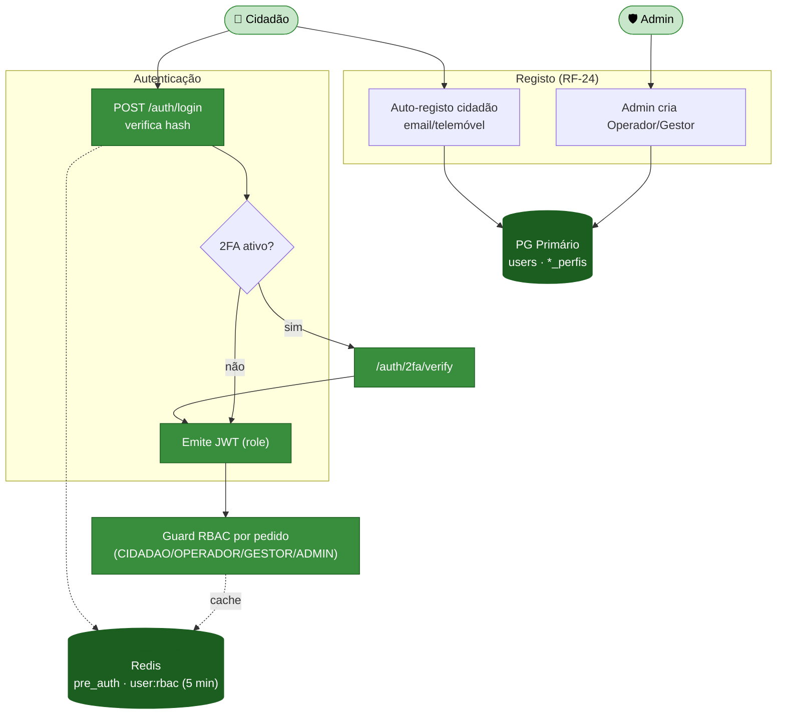
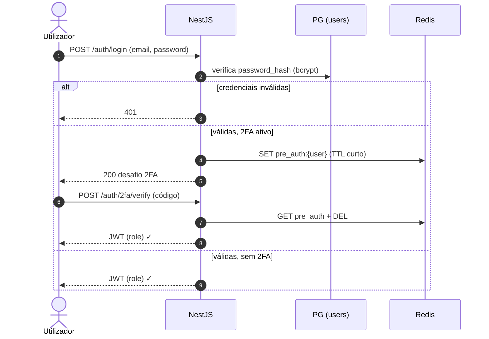
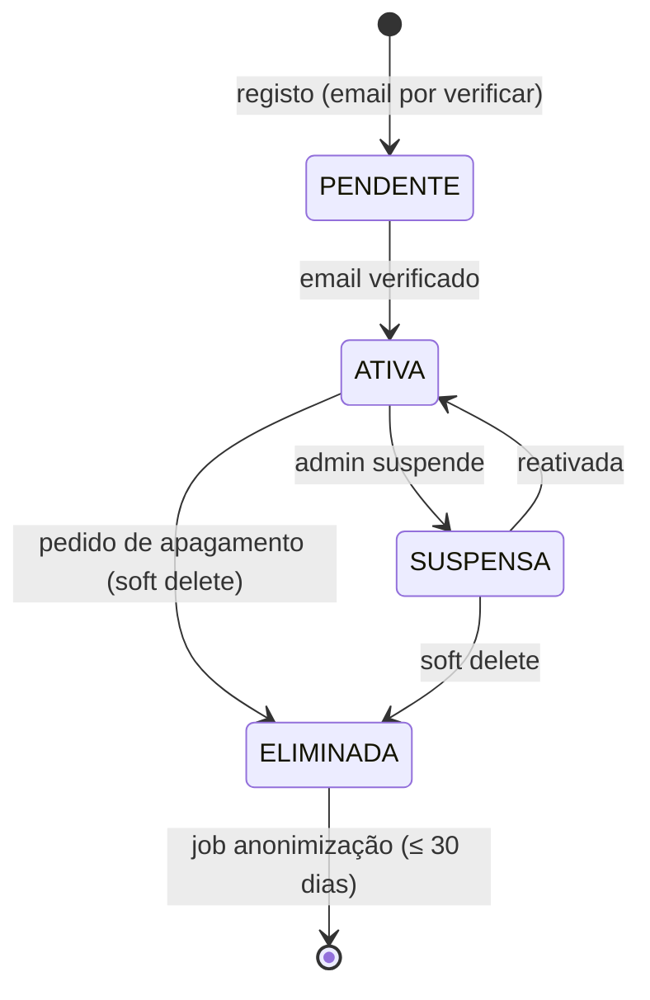

# Módulo 9 — Utilizadores e Perfis

> Parte de [[02-Requisitos]] · [[Home]]. Cobre RF-24 a RF-25. Convenção de prioridade: **Alta (A) / Média (M) / Baixa (B) / Futuro (F)**.

Identidade, autenticação e **RBAC** dos quatro papéis (`CIDADAO / OPERADOR / GESTOR / ADMIN`), e a recolha **opcional e inativa** de dados pessoais sensíveis (NIF, morada) preparada para o futuro controlo de quantidade. 

## Atores envolvidos

| Ator | Papel neste módulo |
|------|--------------------|
| 👤 **Cidadão** | Auto-registo (email/telemóvel), gestão de perfil e consentimentos. |
| 🚚 **Operador** / 🧑‍💼 **Gestor** | Contas **criadas pelo Admin** (sem auto-registo). |
| 🛡️ **Admin** | Cria/gere utilizadores e papéis; acesso auditado a dados sensíveis. |

## Requisitos

| RF         | Prio. | Descrição                                                                                                                                                           | Critérios de aceitação                                                                     |
| ---------- | :---: | ------------------------------------------------------------------------------------------------------------------------------------------------------------------- | ------------------------------------------------------------------------------------------ |
| **RF-24**  |   A   | **Registo/Autenticação.** Cidadão (auto-registo), Operador, Gestor, Admin. Operadores e Gestores são **criados pelo Admin**.                                        | **RBAC** aplicado (RNF-SEG-02).                                                            |
| **RF-25**  |   A   | **Dados pessoais sensíveis (preparação futura).** Nome, NIF e morada **apenas com consentimento explícito**, finalidade "futuro controlo de quantidade" (inativos). | Recolha opcional; etiqueta de finalidade; acessos restritos; **apagamento** (RNF-PRIV-03). |

## Fluxograma — registo, autenticação e RBAC

## Fluxo crítico — login com 2FA (RF-24)

## Ciclo de vida — conta de utilizador (RF-25/RNF-PRIV-03)

## Regras de negócio

- **Quatro papéis (RF-24)** — `users.role CHECK IN ('CIDADAO','OPERADOR','GESTOR','ADMIN')`. Operador e Gestor **não** têm auto-registo; o Admin cria as contas. RBAC validado por pedido (cache `user:rbac` TTL 5 min).
- **Três camadas de identidade** — `users` (auth) + extensões `cidadao_perfis` / `gestor_perfis` / `operador_perfis` (1:1 por papel). Ver [[models/Cidadão/Init|Domínio Cidadão]].
- **PII cifrada e inativa (RF-25)** — NIF/morada **desativados por defeito**, cifrados AES-256 pela aplicação (o PostgreSQL nunca vê o valor em claro); busca por NIF via `HMAC-SHA256` indexado. Consentimentos append-only com timestamp e versão.
- **Soft delete + anonimização (RNF-PRIV-03)** — `users.eliminado_em` marca a conta; um job assíncrono anonimiza dados pessoais ≤ 30 dias, preservando o UUID para integridade de reports históricos.

## Ver também

- [[03-Casos-de-Uso]] — pacotes *Autenticação e Perfil* e *Administração*
- [[01-Introducao#Glossário de papéis]] · [[02-Requisitos/RNF-Nao-Funcionais#Privacidade & RGPD|RNFs de Privacidade]]
- [[models/Cidadão/Init|Domínio Cidadão/Identidade]]
- [[07-Modelo-de-Dados]]
