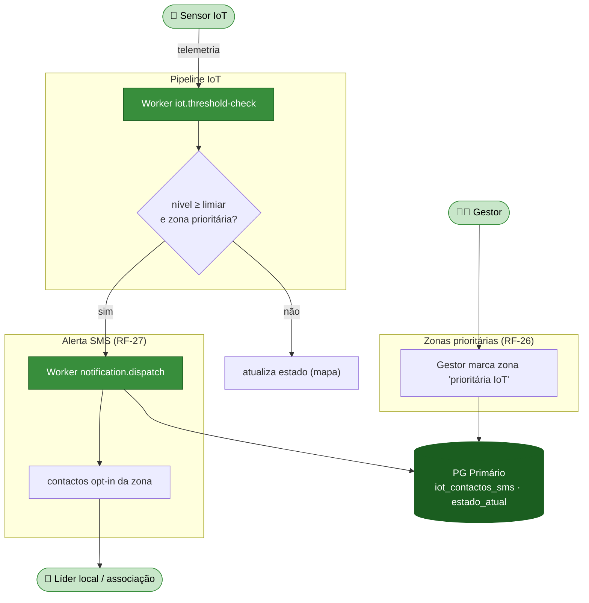
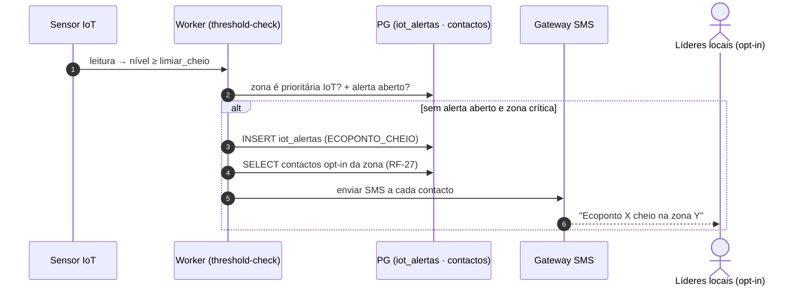

# Módulo 10 — Acesso inclusivo e envelhecidas (IoT)

> Parte de [[02-Requisitos]] · [[Home]]. Cobre RF-26 a RF-27. Convenção de prioridade: **Alta (A) / Média (M) / Baixa (B) / Futuro (F)**.

Garante **equidade de serviço** em zonas com população envelhecida e baixa penetração de smartphones (<30–35%): o estado dos ecopontos é assegurado por **IoT** (não depende do reporte do cidadão) e os alertas críticos chegam por **SMS** a líderes locais e associações, sem necessidade de app.

## Atores envolvidos

| Ator | Papel neste módulo |
|------|--------------------|
| 📡 **Sensor IoT** | Assegura o estado em zonas marcadas como prioritárias. |
| 🧑‍💼 **Gestor** | Marca zonas prioritárias e gere a lista de contactos SMS. |
| 📱 **Líder local / associação** | Recebe alertas SMS opt-in (sem app). |

## Requisitos

| RF | Prio. | Descrição | Critérios de aceitação |
|----|:----:|-----------|------------------------|
| **RF-26** | A | **Cobertura por sensores** em áreas com <30–35% de smartphones. Estados "cheio/disponível" assegurados por IoT, garantindo equidade. | Zonas marcadas como **"prioritárias IoT"** no backoffice. |
| **RF-27** | M | **Alertas automáticos sem app.** Aviso por **SMS** a líderes locais/associações quando ecopontos críticos atingem limiar. | Lista de contactos **opt-in por zona**. |

## Fluxograma — cobertura IoT e alerta SMS

## Fluxo crítico — alerta SMS por limiar (RF-27)

## Regras de negócio

- **Equidade por IoT (RF-26)** — em zonas prioritárias, o estado **não** depende de reportes do cidadão; a marcação "prioritária IoT" é feita pelo Gestor no backoffice ([[02-Requisitos/M02-IoT-Operacoes|Módulo 2]]).
- **SMS opt-in (RF-27)** — só recebem SMS os contactos que deram consentimento, registados em `iot_contactos_sms` por zona. SMS reservado a alertas críticos (evita custo/ruído).
- **Escalonamento** — se o offline persistir além de 2× o timeout, o SMS é reforçado aos contactos da zona (ver offline-detector em [[models/IoT e Dispositivos/Init|Domínio IoT]]).
- **Canal partilhado** — o envio reutiliza o `notification.dispatch` do [[02-Requisitos/M05-Comunicacao|Módulo 5]].

## Ver também

- [[03-Casos-de-Uso]] — pacote *IoT / Telemetria*
- [[02-Requisitos/M02-IoT-Operacoes|Módulo 2]] · [[02-Requisitos/M05-Comunicacao|Módulo 5]]
- [[models/IoT e Dispositivos/Init|Domínio IoT — contactos SMS e offline-detector]]
- [[01-Introducao#Glossário de papéis]]
