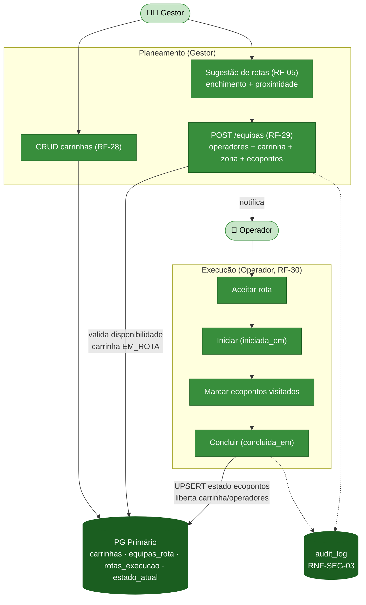
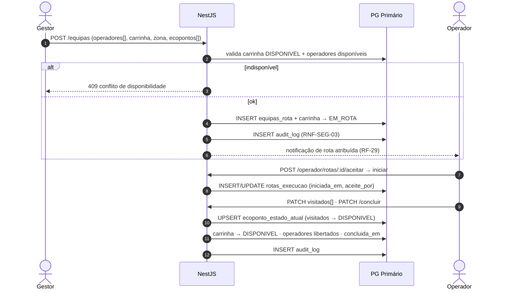
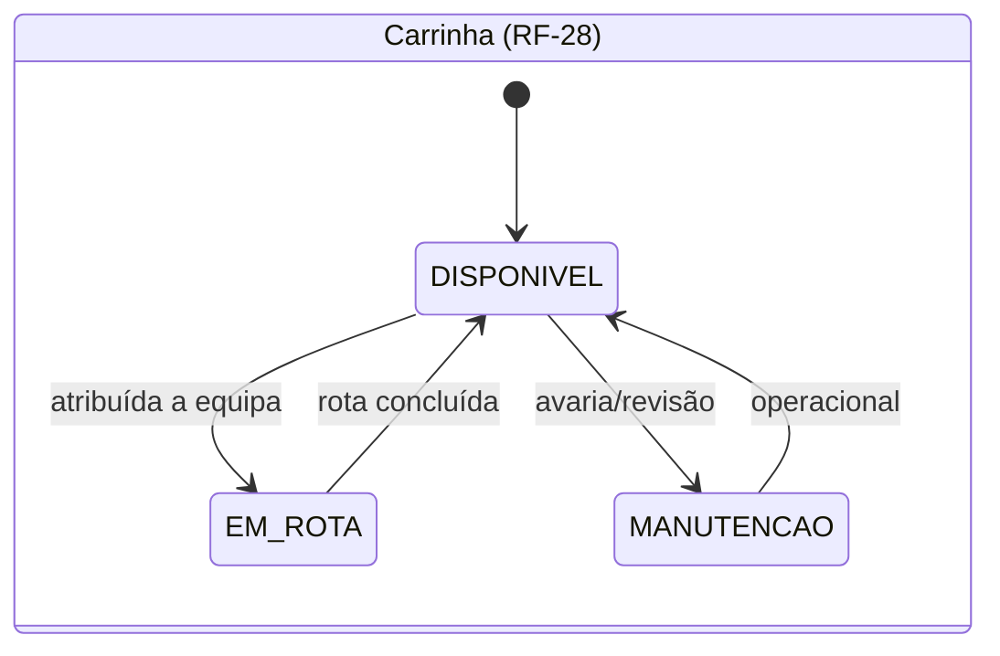
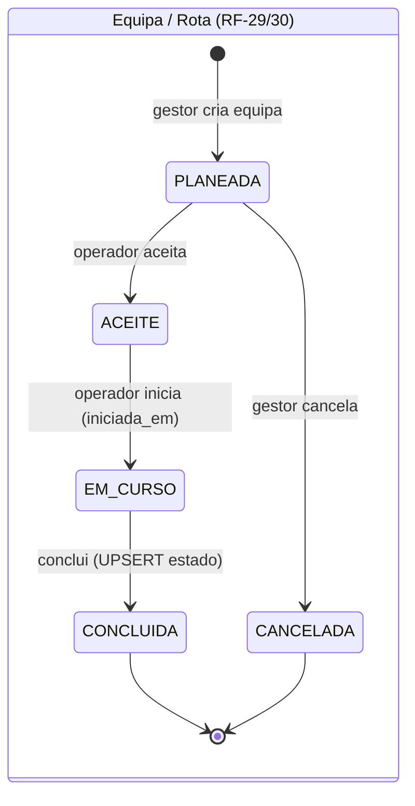

# Módulo 11 — Frota e Equipas de Rota 🔧 (novo)

> Parte de [[02-Requisitos]] · [[Home]]. Cobre RF-28 a RF-30. Convenção de prioridade: **Alta (A) / Média (M) / Baixa (B) / Futuro (F)**.

Operacionaliza o nível **Operador** e a **execução física das rotas**, em falta na versão anterior da documentação. O **Gestor** gere a frota de **carrinhas** e monta **equipas de rota** (operadores + carrinha + zona + ecopontos); o **Operador** recebe, executa e conclui a rota, atualizando o estado dos ecopontos visitados. Detalhe de schema em [[models/Reports, Recolhas, Comunicação e Operacional/rotas operacionais/Gestão de Frota e Equipas (Gestor)|Gestão de Frota e Equipas]] e [[models/Reports, Recolhas, Comunicação e Operacional/rotas operacionais/Execução de Rota (Operador)|Execução de Rota]].

## Atores envolvidos

| Ator | Papel neste módulo |
|------|--------------------|
| 🧑‍💼 **Gestor** | CRUD de carrinhas; monta equipas de rota a partir da sugestão de rotas (RF-05). |
| 🚚 **Operador** | Recebe, aceita, inicia, marca visitas e conclui a rota. |
| 🛡️ **Admin** | Herda o Gestor; gere a frota. |

## Requisitos

| RF         | Prio. | Descrição                                                                                                                                               | Critérios de aceitação                                                                             |
| ---------- | :---: | ------------------------------------------------------------------------------------------------------------------------------------------------------- | -------------------------------------------------------------------------------------------------- |
| **RF-28**  |   A   | **Gestão de frota (carrinhas).** CRUD de carrinhas: matrícula, tipo, capacidade, zona-base e estado (`DISPONIVEL`/`EM_ROTA`/`MANUTENCAO`).              | Matrícula única; carrinha indisponível **não** pode ser atribuída; histórico de estado.            |
| **RF-29**  |   A   | **Criação de equipas de rota.** Gestor associa operador(es) + carrinha + zona + ecopontos planeados.                                                    | Só operadores/carrinha **disponíveis**; **notifica** os operadores; regista o gestor responsável.  |
| **RF-30**  |   A   | **Execução de rota pelo operador.** Operador **aceita**, **inicia**, **marca visitados** e **conclui**. Ao concluir, UPSERT em `ecoponto_estado_atual`. | Regista `iniciada_em`/`concluida_em`; geometria opcional (LINESTRING); **auditável** (RNF-SEG-03). |

## Fluxograma — do planeamento (Gestor) à execução (Operador)

## Fluxo crítico — criar equipa e concluir rota (RF-29 → RF-30)

## Ciclos de vida — carrinha, equipa e rota

## Regras de negócio

- **Matrícula única + disponibilidade (RF-28)** — uma carrinha em `MANUTENCAO`/`EM_ROTA` **não** pode ser atribuída a uma nova equipa; toda a mudança de estado fica no histórico.
- **Equipa agrega recursos (RF-29)** — `equipas_rota` liga gestor + carrinha + zona + operador(es). A criação valida disponibilidade, coloca a carrinha em `EM_ROTA` e **notifica** os operadores ([[02-Requisitos/M05-Comunicacao|Módulo 5]]).
- **Indireção rota → equipa** — `rotas_execucao` referencia **`equipa_id`** (não o operador diretamente); a equipa é que agrega os recursos. Ver [[07-Modelo-de-Dados]].
- **Conclusão atualiza o mapa (RF-30)** — ao concluir, os ecopontos visitados sofrem UPSERT em `ecoponto_estado_atual` (→ `DISPONIVEL`), refletindo no mapa ([[02-Requisitos/M01-Mapa-Ecopontos|Módulo 1]]); carrinha e operadores são libertados.
- **Auditoria (RNF-SEG-03)** — criação de equipa e marcos da rota geram `INSERT audit_log` (quem/quando/o quê), retenção ≥ 24 meses.

## Ver também

- [[03-Casos-de-Uso]] — pacotes *Backoffice Operacional* e *Operações de Terreno*
- [[02-Requisitos/M02-IoT-Operacoes|Módulo 2 (sugestão de rotas)]] · [[02-Requisitos/M01-Mapa-Ecopontos|Módulo 1]]
- [[models/Reports, Recolhas, Comunicação e Operacional/rotas operacionais/Gestão de Frota e Equipas (Gestor)|Gestão de Frota e Equipas (Gestor)]]
- [[models/Reports, Recolhas, Comunicação e Operacional/rotas operacionais/Execução de Rota (Operador)|Execução de Rota (Operador)]]
- [[07-Modelo-de-Dados]]
