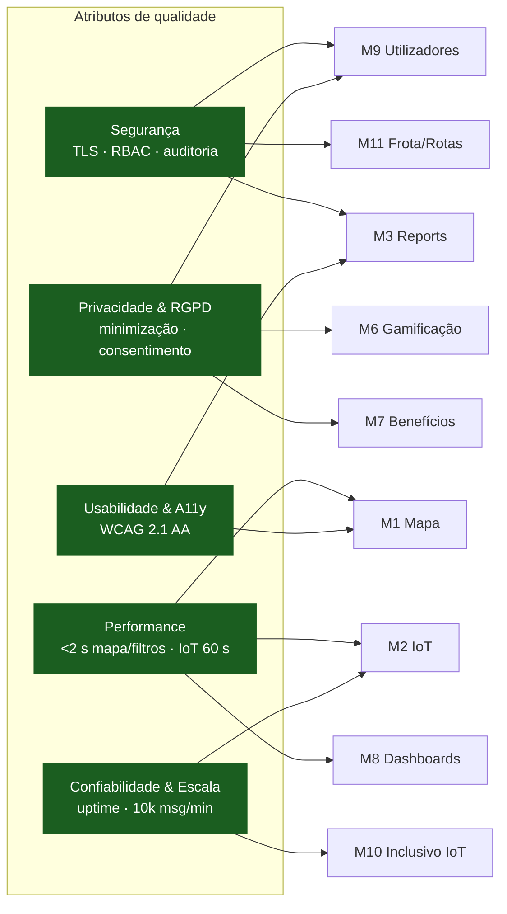

# Requisitos Não Funcionais (RNF)

> Parte de [[02-Requisitos]] · [[Home]]. Atributos de qualidade transversais a todos os módulos funcionais. Convenção de prioridade: **Alta (A) / Média (M) / Baixa (B)**.

Os RNF condicionam **como** o sistema cumpre os requisitos funcionais — segurança, privacidade, performance, usabilidade, confiabilidade e conformidade legal. As métricas indicadas são verificáveis.

## Mapa de impacto (RNF × módulos)

## Segurança

- **RNF-SEG-01 (A) — Transporte seguro.** Todo o tráfego cifrado (TLS 1.3).
- **RNF-SEG-02 (A) — Controlo de acessos (RBAC).**  Perfis: **Cidadão / Operador / Gestor / Admin**
- **RNF-SEG-03 (A) — Registos e auditoria.** Ações administrativas e alterações de estado de reports/**rotas/equipas/frota** são auditadas (quem, quando, o quê). *Métrica:* retenção ≥ 24 meses.

## Privacidade & RGPD

- **RNF-PRIV-01 (A) — Minimização de dados.** NIF e morada **desativados por defeito** ([[02-Requisitos/M09-Utilizadores-Perfis|RF-25]]).
- **RNF-PRIV-02 (A) — Finalidades claras e consentimento.** Textos específicos por finalidade. *Métrica:* 100% dos consentimentos com timestamp e versão.
- **RNF-PRIV-03 (A) — Direitos dos titulares.** Acesso, retificação e apagamento via app. *Métrica:* ≤ 30 dias.
- **RNF-PRIV-04 (A) — Pseudonimização para analytics.** KPIs agregados sem identificadores pessoais.

## Performance

- **RNF-PERF-01 (A) — Arranque e mapa.** Ecrã inicial ≤ 2 s; primeiro render do mapa ≤ 3 s em 4G.
- **RNF-PERF-02 (A) — Filtragem/pesquisa.** ≤ 2 s para até 5.000 ecopontos.
- **RNF-PERF-03 (M) — Ingestão IoT.** Do sensor ao dashboard em ≤ 60 s.
- **RNF-PERF-04 (M) — Geração de rotas.** Sugestões iniciais ≤ 10 s para 200 pontos candidatos.

## Usabilidade & Acessibilidade

- **RNF-USA-01 (A)** — Usabilidade como NFR (eficácia/eficiência/satisfação, ISO 9241).
- **RNF-USA-02 (A)** — Criar um report em **≤ 3 ecrãs** com feedback claro. *Métrica:* ≥ 90% concluem sem ajuda.
- **RNF-USA-03 (A)** — Acessibilidade **WCAG 2.1 AA**; alvos de toque ≥ 44×44 px (Lei de Fitts).
- **RNF-USA-04 (M)** — Universal usability / população sénior (reconhecimento > lembrança).

## Confiabilidade, Escala, Legal e mais

- **RNF-CONF-01 (A)** — Uptime do backend ≥ 99,5% mensal.
- **RNF-CONF-02 (M)** — Sensores offline → ecoponto "sem leitura recente" com data/hora.
- **RNF-ESC-01 (M)** — Suportar ≥ 10.000 mensagens/minuto de telemetria.
- **RNF-INT-01 (M)** — APIs REST/JSON abertas; autenticação OAuth2.
- **RNF-LEGAL-01 (A)** — Conformidade RGPD/PT; DPO; DPIA para módulos sensíveis.
- **RNF-DADOS-01 (M)** — Retenção padrão **24 meses**; anonimização após o prazo.
- **RNF-TRANS-01 (M)** — Página pública com números agregados.
- **RNF-LOC-01 (A)** — **pt-PT**; termos contextualizados para Aveiro.
- **RNF-UXD-01 (M)** — Responsive (iOS/Android/web).

## Ver também

- [[02-Requisitos]] — índice e requisitos funcionais
- [[06-Arquitetura]] — decisões que materializam estes RNF (CQRS, PostGIS, Redis, RBAC)
- [[01-Introducao#Glossário de papéis]]
