# 03 · Diagrama de Casos de Uso

Casos de uso do EcoBairro Digital organizados por pacote funcional e ligados aos quatro atores humanos (**Cidadão, Operador, Gestor, Admin**) e ao ator de sistema **Sensor IoT**. Como o Mermaid não tem um tipo nativo de *use case*, representa-se com um `flowchart`: os atores são nós em estádio e cada caso de uso é um nó retangular dentro do seu pacote.

> Retificação: os casos de uso de **gestão** (dashboard, zonas, rotas, campanhas, mensagens) passaram do antigo "Operador" para **Gestor**; adicionou-se o pacote **Operações de Terreno** para o **Operador** e os casos **Gerir Frota** e **Criar Equipa de Rota** para o Gestor.

```mermaid
flowchart LR
    %% ── Atores ──
    C(["👤 Cidadão"])
    O(["🚚 Operador<br/>(terreno)"])
    G(["🧑‍💼 Gestor<br/>(Veolia/Autarquia/CCDR)"])
    A(["🛡️ Admin"])
    IOT(["📡 Sensor IoT"])

    subgraph AUTH["Autenticação e Perfil"]
        UC_AUTH["Registar / Autenticar"]
        UC_PERFIL["Gerir Perfil e<br/>Consentimentos RGPD"]
    end

    subgraph MAPA["Mapa e Ecopontos"]
        UC_MAPA["Consultar Mapa"]
        UC_FILTRO["Filtrar Ecopontos"]
        UC_DETALHE["Ver Detalhe"]
        UC_FAV["Gerir Favoritos"]
    end

    subgraph REP["Reports"]
        UC_REPORT["Criar Report<br/>Georreferenciado"]
        UC_ESTADO["Acompanhar Estado"]
        UC_DUP["Subscrever Duplicado"]
        UC_TRIAGEM["Triar e Encaminhar"]
        UC_UPDATE["Atualizar Estado"]
    end

    subgraph MONOS["Monos e Partilha"]
        UC_MONOS["Consultar Guia de Monos"]
        UC_RECOLHA["Submeter Pedido de Recolha"]
        UC_PARTILHA["Partilhar Materiais"]
    end

    subgraph GAMI["Gamificação (opt-in)"]
        UC_OPTIN["Ativar/Desativar"]
        UC_QUIZ["Participar no Quiz"]
        UC_BADGES["Ver Badges e Ranking"]
    end

    subgraph NOTIF["Comunicação"]
        UC_NOTIF["Receber Notificações"]
        UC_PREF["Configurar Preferências"]
        UC_MSG["Publicar Mensagem<br/>Institucional"]
    end

    subgraph BO["Backoffice Operacional (Gestor)"]
        UC_DASH["Dashboard Operacional<br/>(KPIs / calor)"]
        UC_FILA["Gerir Fila de Prioridades"]
        UC_ZONAS["Gerir Zonas"]
        UC_ROTAS["Planear / Sugerir Rotas"]
        UC_FROTA["Gerir Frota (Carrinhas)"]
        UC_EQUIPA["Criar Equipa de Rota"]
        UC_EXPORT["Exportar Dados (CSV/XLSX)"]
        UC_CAMP["Criar Campanha de Benefício"]
    end

    subgraph TERRENO["Operações de Terreno (Operador)"]
        UC_RECEBER["Receber Rota / Equipa"]
        UC_EXEC["Executar Recolha"]
        UC_VISITA["Registar Ecoponto Visitado"]
        UC_CONCLUIR["Iniciar / Concluir Rota"]
    end

    subgraph ADM["Administração"]
        UC_USERS["Gerir Utilizadores e Perfis"]
        UC_ECO_ADM["Gerir Ecopontos e Sensores"]
        UC_AUDIT["Consultar Audit Log"]
        UC_BADGE_ADM["Gerir Badges e Quiz"]
    end

    subgraph IOTP["IoT / Telemetria"]
        UC_TELEM["Enviar Telemetria"]
        UC_PROC["Processar Leitura<br/>e Atualizar Estado"]
        UC_ALERT["Gerar Alerta por Limiar"]
    end

    %% ── Cidadão ──
    C --> UC_AUTH & UC_PERFIL & UC_MAPA & UC_FAV
    C --> UC_REPORT & UC_ESTADO
    C --> UC_MONOS & UC_RECOLHA & UC_PARTILHA
    C --> UC_OPTIN & UC_QUIZ & UC_BADGES
    C --> UC_NOTIF & UC_PREF

    %% ── Operador (terreno) ──
    O --> UC_AUTH
    O --> UC_RECEBER & UC_EXEC & UC_VISITA & UC_CONCLUIR

    %% ── Gestor (backoffice) ──
    G --> UC_AUTH
    G --> UC_DASH & UC_FILA & UC_TRIAGEM & UC_UPDATE
    G --> UC_ZONAS & UC_ROTAS & UC_FROTA & UC_EQUIPA
    G --> UC_EXPORT & UC_MSG & UC_CAMP

    %% ── Admin (herda Gestor) ──
    A -.->|herda| G
    A --> UC_USERS & UC_ECO_ADM & UC_AUDIT & UC_BADGE_ADM

    %% ── Sensor IoT ──
    IOT --> UC_TELEM

    %% ── include / extend ──
    UC_TELEM -.->|«include»| UC_PROC
    UC_PROC -.->|«extend»| UC_ALERT
    UC_MAPA -.->|«extend»| UC_FILTRO
    UC_MAPA -.->|«extend»| UC_DETALHE
    UC_REPORT -.->|«extend»| UC_DUP
    UC_DASH -.->|«include»| UC_FILA
    UC_DASH -.->|«extend»| UC_ROTAS
    UC_EQUIPA -.->|«include»| UC_ROTAS
    UC_CONCLUIR -.->|«include»| UC_VISITA

    classDef ator fill:#1B5E20,color:#fff,stroke:#1B5E20,font-weight:bold;
    class C,O,G,A,IOT ator;
```

## Descrição por ator

### Cidadão (`CIDADAO`)
Munícipe autenticado por email/telemóvel. Consulta o mapa e o detalhe dos ecopontos, gere favoritos, cria **reports georreferenciados** (RF-08) e acompanha o seu estado (RF-11), consulta o guia de monos e **submete pedidos de recolha** (RF-14), partilha materiais (RF-15), adere à gamificação (RF-18–20) e configura notificações (RF-16).

### Operador (`OPERADOR`) 
Trabalhador de terreno / motorista. **Recebe a rota e a equipa** atribuídas pelo Gestor (RF-29), conduz a **carrinha**, executa a recolha, **marca os ecopontos visitados** e **inicia/conclui a rota** (RF-30). Ao concluir, o estado dos ecopontos é atualizado.

### Gestor (`GESTOR`) 
Backoffice operacional (Veolia/Autarquia/CCDR). Usa o **dashboard operacional** (RF-05), faz **triagem de reports** (RF-10), gere **zonas** (RF-06), **planeia rotas** (RF-05), **gere a frota de carrinhas** (RF-28), **cria equipas de rota** (RF-29), exporta dados (RF-23), publica **mensagens institucionais** (RF-17) e cria **campanhas** (RF-21).

### Admin (`ADMIN`)
Herda todas as capacidades do Gestor e acrescenta gestão de **utilizadores/perfis** (RF-24), de **ecopontos e sensores**, do **catálogo de badges/quiz** e consulta do **audit log** (RNF-SEG-03).

### Sensor IoT (ator de sistema)
Envia telemetria de enchimento (RF-04); o sistema processa a leitura, atualiza o estado e gera alertas por limiar (RF-26/RF-27).

## Ver também

- [[02-Requisitos]] — requisitos por trás de cada caso de uso
- [[04-Modelo-de-Conceitos]] — entidades manipuladas
- [[01-Introducao#Glossário de papéis]]
