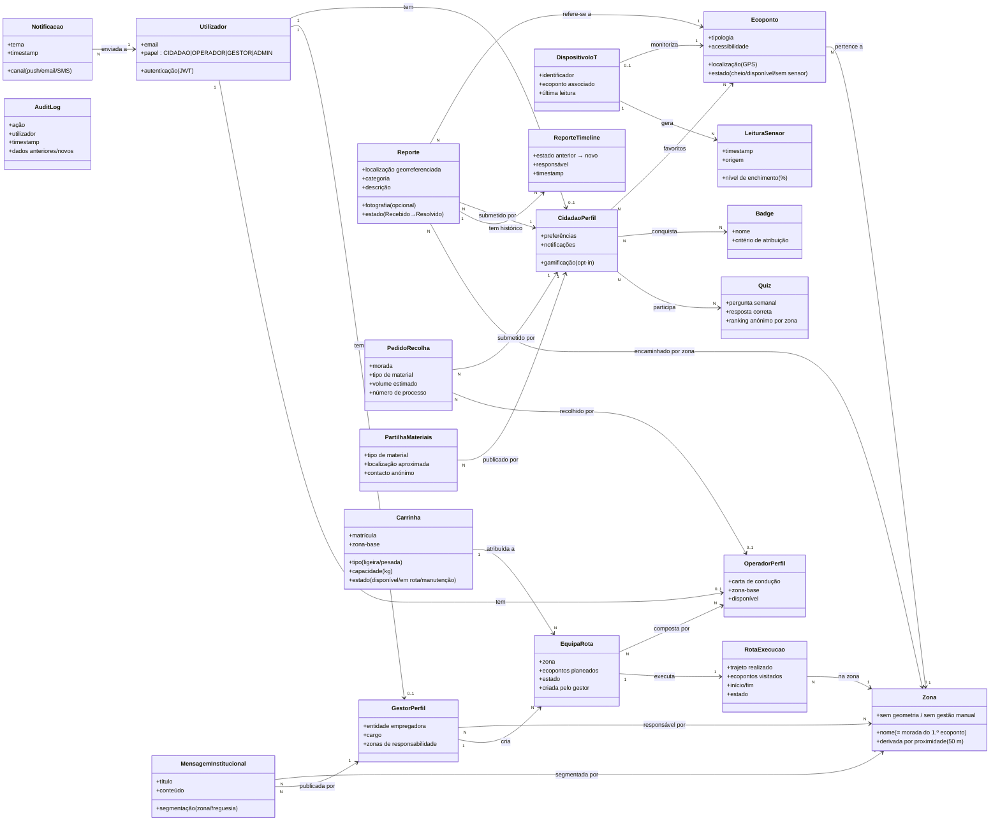

# 04 · Modelo de Conceitos

Modelo conceptual do domínio EcoBairro Digital: as entidades de negócio e as suas relações, independentes da implementação. Migrado do antigo `uml_modelo_conceitos.puml` e **retificado** com a separação `Gestor`/`Operador`, a **`Carrinha`** (frota) e a **`EquipaRota`**.

## Notas de domínio

- **Zona derivada (novo)** — a `Zona` deixou de ser gerida à mão. É uma etiqueta
  derivada automaticamente: um `Ecoponto` novo herda a zona de um vizinho a ≤ 50 m; se
  isolado, forma zona nova com o nome da sua morada. Não tem polígono nem CRUD; as
  relações `--> Zona` representam agrupamento pela etiqueta, não FK para uma tabela.
- **Anti-spam** — uma `Zona` limita a **2 reportes por utilizador / 24 h** (RF-09).
- **Estado cacheado** — as `LeituraSensor` são processadas e o estado atual é cacheado para carregamento <2 s no mapa (RNF-PERF-01).
- **Frota e equipas (novo)** — o `GestorPerfil` cria uma `EquipaRota` associando `OperadorPerfil`(es) + uma `Carrinha` + uma `Zona`; a `RotaExecucao` está ligada à equipa, não diretamente a um utilizador. O `OperadorPerfil` executa fisicamente.
- **Recolha de monos** — o `PedidoRecolha` do cidadão é executado em terreno por um `OperadorPerfil` (RF-14).
- **Auditoria** — o `AuditLog` regista operações sensíveis (reports, rotas, frota, equipas) com retenção ≥ 24 meses (RNF-SEG-03).

## Ver também

- [[05-Diagrama-de-Classes]] — versão técnica com tipos e métodos
- [[07-Modelo-de-Dados]] — tabelas físicas correspondentes
- [[03-Casos-de-Uso]]
