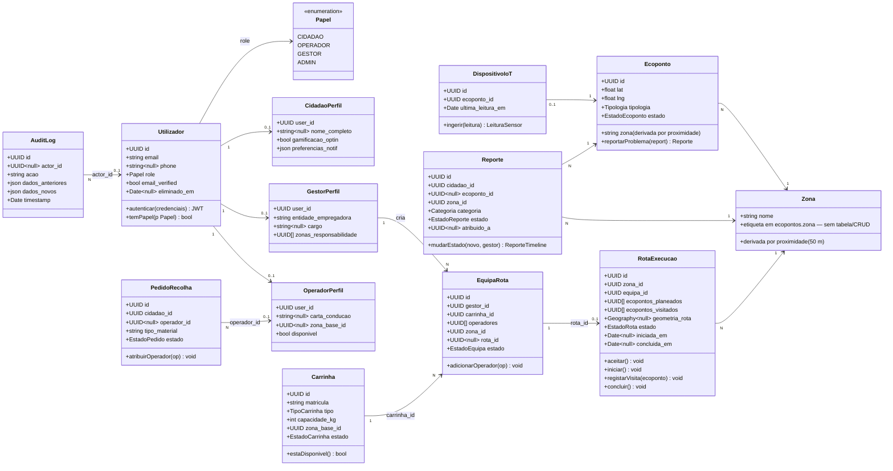

# 05 · Diagrama de Classes

Vista **técnica** das classes do domínio: atributos tipados e métodos de serviço, alinhados com as tabelas PostgreSQL ([[07-Modelo-de-Dados]]) e os endpoints REST. Complementa o [[04-Modelo-de-Conceitos|modelo conceptual]] com a perspetiva de implementação (NestJS/TypeORM).

## Enumerações principais

| Enum | Valores |
|------|---------|
| `Papel` | `CIDADAO`, `OPERADOR`, `GESTOR`, `ADMIN` |
| `EstadoEcoponto` | `DISPONIVEL`, `CHEIO`, `SEM_SENSOR` |
| `EstadoReporte` | `RECEBIDO`, `EM_ANALISE`, `EM_RESOLUCAO`, `RESOLVIDO`, `REJEITADO` |
| `EstadoCarrinha` | `DISPONIVEL`, `EM_ROTA`, `MANUTENCAO` |
| `EstadoEquipa` | `PLANEADA`, `ATIVA`, `CONCLUIDA`, `CANCELADA` |
| `EstadoRota` | `ACEITE`, `EM_CURSO`, `CONCLUIDA`, `CANCELADA` |

## Ver também

- [[04-Modelo-de-Conceitos]] — vista conceptual
- [[07-Modelo-de-Dados]] — schemas SQL detalhados
- [[models/Reports, Recolhas, Comunicação e Operacional/rotas operacionais/Gestão de Frota e Equipas (Gestor)|Endpoints de frota e equipas]]
