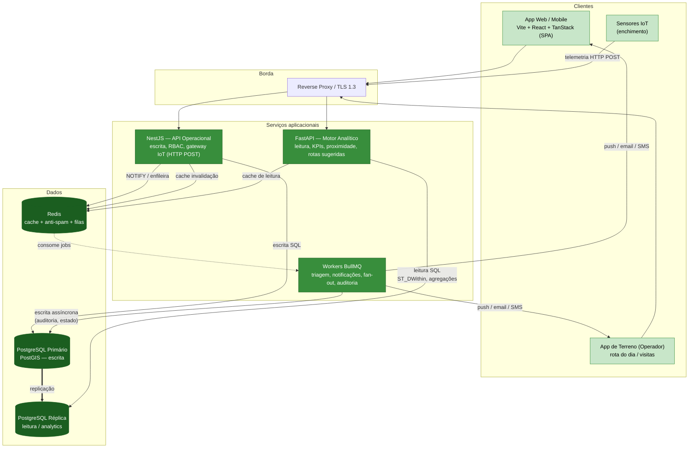

# 06 · Arquitetura

Arquitetura de software e dados do EcoBairro Digital. Separa **escrita operacional** (NestJS) de **leitura analítica** (FastAPI), com PostgreSQL em **primário + réplica** (PostGIS), Redis como cache/anti-spam e BullMQ para trabalho assíncrono. Migrado dos diagramas de `documentos/diagramas da arquitetura/` (NestJS Operational, FastAPI Analytical Engine, IoT Analytics Heatmap, Data Processing).

## Vista de componentes

## Padrões de fluxo (resumo)

| Fluxo                  | Caminho                                         | Exemplo                                                       |
| ---------------------- | ----------------------------------------------- | ------------------------------------------------------------- |
| **Escrita**            | NestJS → PG primário → NOTIFY/BullMQ            | `POST /reports` (anti-spam Redis → write → triagem)           |
| **Leitura rápida**     | NestJS → Redis → PG réplica                     | `GET /notificacoes/count` (Redis 5 min)                       |
| **Analytics**          | FastAPI → Redis → PG réplica                    | `GET /reports/proximos` (ST_DWithin), `GET /reports/kpis`     |
| **IoT**                | Sensor → NestJS gateway → PG → estado cacheado  | `POST` telemetria → UPSERT `ecoponto_estado_atual` (≤ 60 s)   |
| **Auditoria**          | Middleware NestJS → BullMQ → PG (append-only)   | toda a operação sensível → `INSERT audit_log`                 |
| **Operacional (novo)** | Gestor planeia → cria equipa → Operador executa | `POST /equipas` → `PATCH /rotas/:id/concluir` (UPSERT estado) |

## Decisões-chave

- **CQRS leve** — escrita no primário (NestJS), leitura/analytics na réplica (FastAPI), reduzindo contenção e cumprindo `RNF-PERF`.
- **PostGIS** — geometria de zonas (`MULTIPOLYGON`) e rotas (`LINESTRING`); proximidade via `ST_DWithin`.
- **Redis** — cache de estado dos ecopontos (mapa <2 s), contadores anti-spam (RF-09) e backend das filas BullMQ.
- **RBAC** em NestJS — `CIDADAO / OPERADOR / GESTOR / ADMIN` (RNF-SEG-02).

## Ver também

- [[07-Modelo-de-Dados]] — tabelas e relações
- [[_playbooks/08-api-implementation-playbook|Playbook da API NestJS]]
- [[_playbooks/06-frontend-scaffold|Scaffold do frontend]]
- [[models/IoT e Dispositivos/Init|Domínio IoT]]
