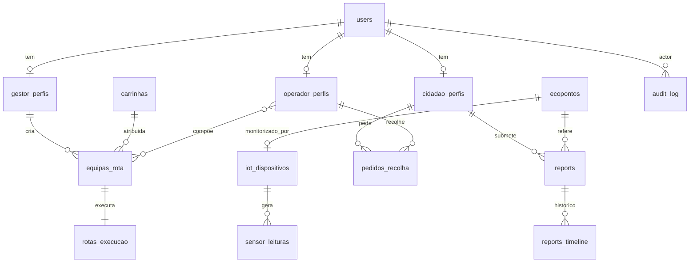

# 07 · Modelo de Dados

Índice do modelo de dados físico (PostgreSQL + Redis). O detalhe de cada tabela e dos endpoints REST vive em [[Home#2. Modelo de dados detalhado models|`models/`]], organizado por domínio. Esta página dá a **vista de conjunto** e o **mapa de relacionamentos** atualizado com a frota e as equipas de rota.

## Domínios

| Domínio | Índice | Conteúdo |
|---------|--------|----------|
| Cidadão / Identidade | [[models/Cidadão/Init]] | `users`, `cidadao_perfis`, `gestor_perfis`, `operador_perfis`, auth, RGPD |
| Ecopontos, Zonas, Badges, Quiz | [[models/Ecopontos, Zonas, Badges e Quiz/Init]] | `ecopontos` (zona = etiqueta derivada por proximidade, sem tabela `zonas`), `badges`, `quiz` |
| IoT e Dispositivos | [[models/IoT e Dispositivos/Init]] | `iot_dispositivos`, `sensor_leituras`, `ecoponto_estado_atual`, alertas, SMS |
| Reports, Recolhas, Comunicação, Operacional | [[models/Reports, Recolhas, Comunicação e Operacional/init]] | `reports`, `pedidos_recolha`, `partilhas`, `notificacoes`, `mensagens`, `campanhas`, **`carrinhas`**, **`equipas_rota`**, `rotas_execucao`, `audit_log` |

## Tabelas do domínio operacional (frota e rotas)

| Tabela           | Página                                                                                                                          | Papel                                                      |
| ---------------- | ------------------------------------------------------------------------------------------------------------------------------- | ---------------------------------------------------------- |
| `carrinhas`      | [[models/Reports, Recolhas, Comunicação e Operacional/rotas operacionais/base de dados/7.2 Schema PostgreSQL — carrinhas]]      | Frota de veículos de recolha (Gestor/Admin)                |
| `equipas_rota`   | [[models/Reports, Recolhas, Comunicação e Operacional/rotas operacionais/base de dados/7.3 Schema PostgreSQL — equipas_rota]]   | Operador(es) + carrinha + zona + rota (criada pelo Gestor) |
| `rotas_execucao` | [[models/Reports, Recolhas, Comunicação e Operacional/rotas operacionais/base de dados/7.1 Schema PostgreSQL — rotas_execucao]] | Execução física pelo Operador (ligada a `equipas_rota`)    |

## Perfis de utilizador

| Tabela             | Página                                                                    | Papel                                  |
| ------------------ | ------------------------------------------------------------------------- | -------------------------------------- |
| `cidadao_perfis`   | [[models/Cidadão/base de dados/2.9 Schema PostgreSQL — cidadao_perfis]]   | Munícipe                               |
| `gestor_perfis`    | [[models/Cidadão/base de dados/2.10 Schema PostgreSQL — gestor_perfis]]   | Backoffice (entidade, cargo, zonas)    |
| `operador_perfis`  | [[models/Cidadão/base de dados/2.11 Schema PostgreSQL — operador_perfis]] | Terreno (carta, zona-base, disponível) |

## Mapa de relacionamentos 

> **Zona não é tabela.** É a etiqueta `ecopontos.zona`, derivada por proximidade (50 m).
> Não existe entidade `zonas` nem FKs `zona_id`. As relações `zonas ||--o{ …` abaixo
> referem-se ao agrupamento lógico pela etiqueta (e parte são do design anterior, não
> implementado). Ver [[models/Ecopontos, Zonas, Badges e Quiz/zonas/base de dados/1.2 Schema PostgreSQL — zonas|1.2 zonas]].

> Agrupamento por zona (etiqueta string, não FK): `ecopontos.zona` agrupa ecopontos;
> analytics faz `GROUP BY zona`.

> **Retificação principal:** `rotas_execucao` deixou de referenciar `operador_id` diretamente — passa a referenciar **`equipa_id`** (`equipas_rota`). A equipa é que agrega operador(es) + carrinha. Ver [[models/Reports, Recolhas, Comunicação e Operacional/rotas operacionais/base de dados/7.1 Schema PostgreSQL — rotas_execucao|7.1 rotas_execucao]].

## Ver também

- [[06-Arquitetura]] — onde estas tabelas vivem (primário/réplica/Redis)
- [[05-Diagrama-de-Classes]] — mapeamento classe ↔ tabela
- [[models/init e conclusao|Mapa completo de relacionamentos e fluxos]]
