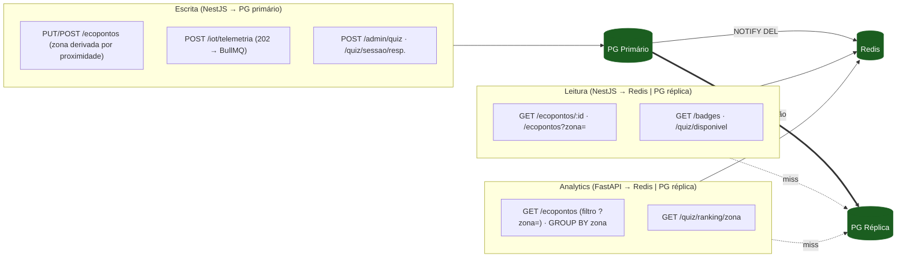

> Parte de [[Home]] · [[07-Modelo-de-Dados]]. Domínio de ecopontos, zonas, badges e quiz.
> Requisitos: [[02-Requisitos/M01-Mapa-Ecopontos|Módulo 1 — Mapa de Ecopontos]] · [[02-Requisitos/M06-Gamificacao|Módulo 6 — Gamificação]].

## 1.1 Zonas — derivadas por proximidade (sem endpoints próprios)

**Mudança de arquitetura:** a zona deixou de ser uma entidade gerida. É uma **etiqueta de
texto derivada automaticamente** da localização do ecoponto (clustering de proximidade a
50 m). **Não há endpoints `/zonas/*`** nem gestão manual — consulta-se via o campo `zona`
dos ecopontos e o filtro `GET /ecopontos?zona=`.
[[Consulta (todos os perfis autenticados)]]
[[Gestão (gestores e superiores)]]


## 1.2 Schema PostgreSQL — `zonas`
[[1.2 Schema PostgreSQL — zonas]]

## 2.1 Endpoints REST — Ecopontos

Ecopontos têm dois perfis de acesso distintos: o cidadão consulta o mapa e reporta; o gestor gere o catálogo e o estado.
[[Consulta pública e cidadão]]
[[Gestão do catálogo]]
[[Ingestão IoT (RF-04)]]

## 2.2 Schema PostgreSQL — Ecopontos
[[2.2 Schema PostgreSQL — Ecopontos]]


## 3.1 Endpoints REST — Badges
Badges têm dois contextos: o catálogo público (quais badges existem) e as badges do cidadão (o que já ganhou).
[[Catálogo (consulta)]]
[[Badges do cidadão]]
[[Arquitetura de Dados e API REST/Ecopontos, Zonas, Badges e Quiz/quiz/Gestão (admin)|Gestão (admin)]]

## 3.2 Schema PostgreSQL — Badges
[[3.2 Schema PostgreSQL — Badges]]

## 4.1 Endpoints REST — Quiz
O quiz tem três contextos distintos: a criação/gestão pelo admin, o consumo pelo cidadão (jogar), e as queries analíticas (ranking, KPIs).
[[Consulta e jogo (cidadão)]]
[[Ranking (analytics)]]
[[Arquitetura de Dados e API REST/Ecopontos, Zonas, Badges e Quiz/quiz/Gestão (admin)|Gestão (admin)]]
## 4.2 Schema PostgreSQL — Quiz
[[4.2 Schema PostgreSQL — Quiz]]


## 5 — Relacionamentos consolidados — todas as entidades

> **Zona não é tabela.** É a etiqueta string `ecopontos.zona`, derivada por proximidade
> (50 m). Não há `zonas(id)` nem FKs `zona_id`. O agrupamento "por zona" faz-se pelo
> valor da string. Referências a `zona_id` noutras tabelas (reports/cidadãos/gamificação)
> são do design anterior, não implementado.

```
zona (etiqueta string em ecopontos.zona — derivada por proximidade 50 m)
  └── agrupa ecopontos pelo valor da string (sem tabela própria)

ecopontos (1)
  ├── (1) ecoponto_estado_atual  FK: ecoponto_estado_atual.ecoponto_id  (1:1)
  │
  ├── (N) sensor_leituras        FK: sensor_leituras.ecoponto_id
  │                              (tabela particionada por mês)
  │
  └── (N) cidadaos               via cidadao_ecopontos_favoritos
                                 (cidadao_id, ecoponto_id) — já definida

badges (1)
  └── (N) cidadaos               via cidadao_badges
                                 (cidadao_id, badge_id) — já definida

quizzes (1)
  ├── (N) quiz_perguntas         FK: quiz_perguntas.quiz_id
  │    └── (N) quiz_opcoes       FK: quiz_opcoes.pergunta_id
  │
  └── (N) cidadaos               via quiz_sessoes
                                 (cidadao_id, quiz_id) — já definida
```

---

## 6 — Separação de fluxos — resumo executivo completo



Detalhe textual por endpoint:

```
ESCRITA — NestJS → PG primário → Redis invalidado
────────────────────────────────────────────────────────
POST /ecopontos             → deriva zona (haversine ≤50 m) → PG write
PUT  /ecopontos/:id         → se lat/lng mudam, recalcula zona → PG write → NOTIFY
POST /iot/telemetria        → 202 imediato → BullMQ ingest job
                              → INSERT sensor_leituras
                              → UPSERT ecoponto_estado_atual
                              → NOTIFY → Redis DEL ecoponto + mapa zona
POST /admin/quiz            → PG write (transacção: quiz + perguntas + opcoes)
                              → NOTIFY → Redis DEL quiz:atual:{tipo}
POST /quiz/:id/iniciar      → verifica quota → Redis SET quiz:sessao:{id} TTL 30min
POST /quiz/sessao/:id/resp. → Redis DEL sessao → PG write quiz_sessoes
                              → BullMQ badge.evaluate

LEITURA — NestJS → Redis hit | PG réplica miss
────────────────────────────────────────────────────────
GET /ecopontos?zona=        → filtro por etiqueta string (case-insensitive)
GET /ecopontos/:id          → Redis ecoponto:{id}  ou PG join estado_atual
GET /badges                 → Redis badges:catalogo ou PG réplica
GET /quiz/disponivel        → Redis quiz:atual:{tipo} ou PG réplica

ANALYTICS — FastAPI → Redis hit | PG réplica miss
────────────────────────────────────────────────────────
GET /ecopontos              → lista + filtro ?zona= (GROUP BY zona no analytics)
GET /ecopontos/proximos     → PG réplica (distância por haversine — dinâmico por GPS)
GET /quiz/ranking/zona/:id  → Redis ranking:zona:{id}:semanal ou PG agregação
```