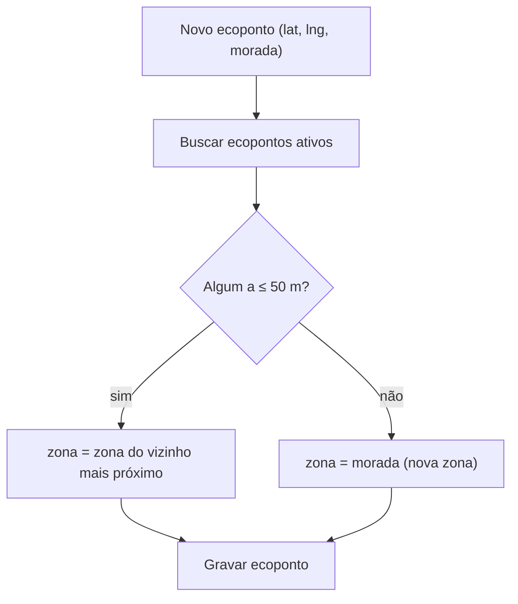

> Parte de [[Init]] · [[07-Modelo-de-Dados]]. Modelo de **zona derivada por proximidade**.

# Zona — modelo de dados (derivado, sem tabela própria)

> **Mudança de arquitetura.** A zona deixou de ser uma entidade gerida à mão. **Não
> existe tabela `zonas`**, nem geometria (`MULTIPOLYGON`), nem chave estrangeira
> `zona_id`, nem queries `ST_Within`. A zona é uma **etiqueta de texto derivada
> automaticamente** da localização do ecoponto, calculada pelo backend por
> **clustering de proximidade** (raio de 50 m).

## Onde vive

A zona é uma única coluna na tabela `ecopontos`:

```
┌──────────────────────────┬──────────────────────┬───────────────────────────┐
│ coluna                   │ tipo                 │ constraints / notas       │
├──────────────────────────┼──────────────────────┼───────────────────────────┤
│ zona                     │ VARCHAR / TEXT       │ nullable                  │
│                          │ (Prisma: String?)    │ derivada — nunca editada   │
│                          │                      │ por um humano             │
└──────────────────────────┴──────────────────────┴───────────────────────────┘
```

As coordenadas que alimentam o cálculo são `ecopontos.lat` e `ecopontos.lng`
(`Float`/double precision). Ver [[2.2 Schema PostgreSQL — Ecopontos]].

## Como é derivada (raio 50 m)

Implementado em `apps/api/src/ecopontos/zona.helper.ts` e invocado por
`EcopontosService.create()` / `update()`:

1. Ao criar um ecoponto (ou mudar a sua localização), busca-se os ecopontos
   **ativos** existentes (`ativo = true`; em updates exclui-se o próprio).
2. Calcula-se a distância (fórmula de **haversine**, `haversineMetros`) entre o
   novo ponto e cada existente.
3. Se houver pelo menos um ponto a **≤ 50 m** (`ZONA_RAIO_METROS`), o novo ponto
   **herda a zona do vizinho mais próximo**.
4. Se estiver isolado (nenhum vizinho ≤ 50 m), forma-se uma **zona nova nomeada
   pela morada** do ponto (com sufixo numérico em caso de colisão de nome).



## O que foi removido (design anterior, nunca implementado)

- Tabela `zonas` (id, nome, **geometria MULTIPOLYGON**, tipo, ativa,
  limites anti-spam, `alertas_config`…).
- Tabela `zonas_historico` (auditoria de alterações de geometria).
- Índice **GIST** sobre geometria e queries `ST_Within` / `ST_Contains` /
  `ST_Intersects`.
- Caches Redis `zona:{id}` e `zonas:ativas:lista`.
- Tipos de zona (`OPERACIONAL` / `RESIDENCIAL` / `PRIORITARIA_IOT` /
  `ADMINISTRATIVA`) e configuração anti-spam por zona.

> As funcionalidades que dependiam de polígono geográfico (anti-spam por zona com
> `ST_Within`, zonas prioritárias IoT, segmentação por geometria) ficam **fora do
> âmbito** deste modelo simplificado. A `zona` serve agora apenas como etiqueta de
> agrupamento para listagem, filtro e analytics.

## Consultar / filtrar

Não há endpoints de zona próprios. A zona consulta-se através do ecoponto:

- `GET /ecopontos` devolve cada ecoponto com o campo `zona` (etiqueta derivada).
- `GET /ecopontos?zona=<valor>` filtra por zona (match exato, case-insensitive).
- Analytics agrupa por `zona` (`GROUP BY zona`, `COALESCE(zona,'Sem zona')`).

Ver [[Consulta (todos os perfis autenticados)]] e [[Gestão do catálogo]].
