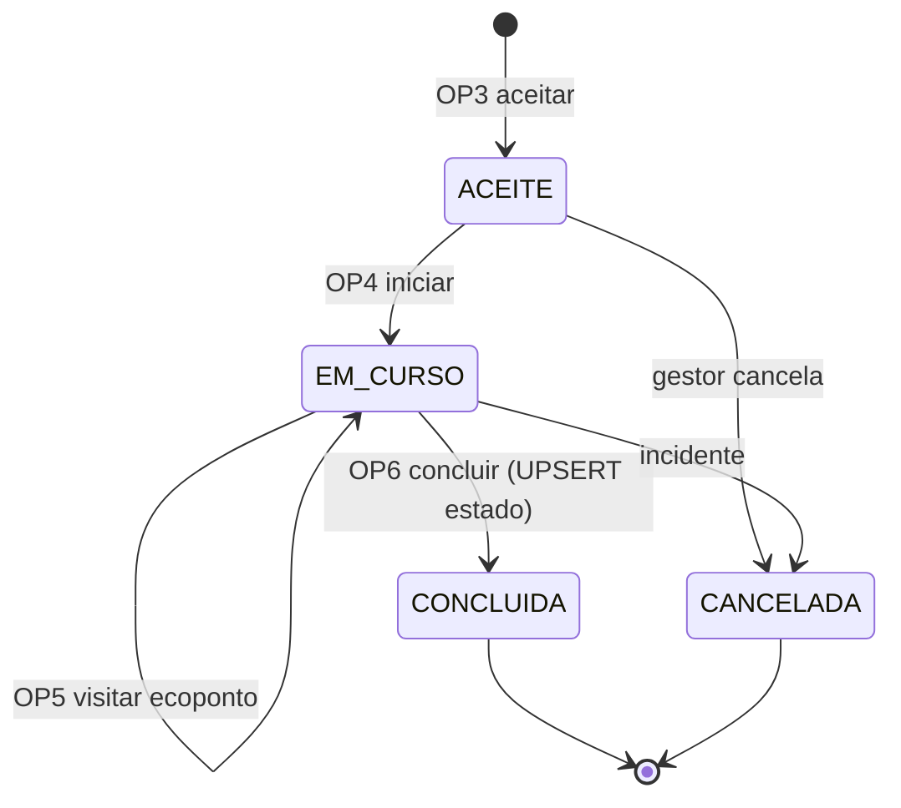

# Endpoints REST — Execução de Rota (Operador) (RF-30)

Endpoints usados pelo **Operador de terreno** para executar a rota atribuída pela sua [[7.3 Schema PostgreSQL — equipas_rota|equipa]]. Materializam a [[7.1 Schema PostgreSQL — rotas_execucao|rotas_execucao]]. O planeamento (criação de equipas) está em [[Gestão de Frota e Equipas (Gestor)]].

| # | Método | Rota | Descrição | Auth | Fluxo |
|---|--------|------|-----------|------|-------|
| OP1 | `GET` | `/operador/equipas` | Equipas/rotas atribuídas ao operador (hoje) | OPERADOR | NestJS → PG (`equipas_rota.operadores @> [me]`) |
| OP2 | `GET` | `/operador/rotas/:id` | Detalhe da rota: ecopontos planeados + estado | OPERADOR | NestJS → Redis/PG |
| OP3 | `POST` | `/operador/rotas/:id/aceitar` | Aceitar a rota da equipa (cria `rotas_execucao`) | OPERADOR | PG write `rotas_execucao` (ACEITE) + liga `equipas_rota.rota_id` |
| OP4 | `PATCH` | `/operador/rotas/:id/iniciar` | Iniciar execução | OPERADOR | PG write `EM_CURSO` + `iniciada_em` → equipa `ATIVA` |
| OP5 | `PATCH` | `/operador/rotas/:id/visitar` | Marcar ecoponto como visitado | OPERADOR | PG append `ecopontos_visitados[]` |
| OP6 | `PATCH` | `/operador/rotas/:id/concluir` | Concluir rota | OPERADOR | PG write `CONCLUIDA` + `concluida_em` → **UPSERT `ecoponto_estado_atual`** → carrinha/operadores libertados |

**Corpo de OP5 (registar visita):**

```
{
  ecoponto_id: uuid (required),
  nivel_pos_recolha: integer (0-100, optional),
  observacao: string (optional)
}
```

**Notas de fluxo (RF-30):**
- `OP3` cria a `rotas_execucao` a partir dos `ecopontos_planeados` da equipa e regista quem aceitou.
- `OP6` faz **UPSERT em `ecoponto_estado_atual`** (estado → `DISPONIVEL`) para os ecopontos visitados, fechando o ciclo com o mapa (≤ 60 s, RNF-PERF-03); liberta a carrinha (`DISPONIVEL`) e os operadores.
- `geometria_rota` (LINESTRING) pode ser preenchida com o trajeto GPS real.
- Todas as transições de estado são auditadas (`audit_log`, RNF-SEG-03).

## Máquina de estados da rota



## Ver também

- [[Gestão de Frota e Equipas (Gestor)]] — quem cria a equipa
- [[7.1 Schema PostgreSQL — rotas_execucao]]
- [[1.10 Perfil do Operador (terreno)]]
- [[02-Requisitos/M11-Frota-Equipas|RF-30]]
