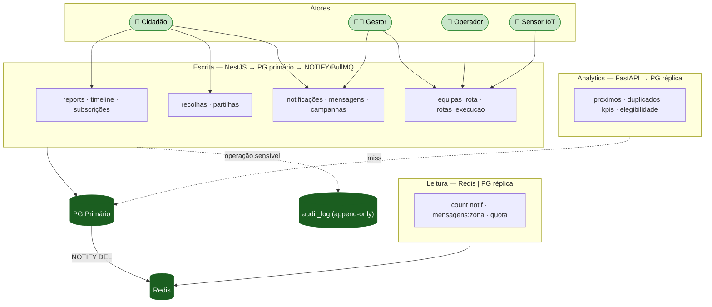

> Parte de [[Home]] · ver também [[07-Modelo-de-Dados]] · [[02-Requisitos|Índice de Requisitos]]. Mapa completo de relacionamentos e fluxos entre todos os domínios.

# Cidadão/User:
[[Cidadão/Init|Init]]

# Ecopontos, Zonas, Badges e Quiz
[[Ecopontos, Zonas, Badges e Quiz/Init|Init]]

# IoT e Dispositivos
[[IoT e Dispositivos/Init|Init]]

# Reports, Recolhas, Comunicação e Operacional
[[Reports, Recolhas, Comunicação e Operacional/init|init]]

#  Mapa completo de relacionamentos

> **Zona não é tabela.** A `zona` é uma etiqueta string em `ecopontos.zona`, derivada por
> proximidade (50 m) — ver [[Ecopontos, Zonas, Badges e Quiz/zonas/base de dados/1.2 Schema PostgreSQL — zonas|1.2 zonas]].
> As entradas `(N:1) zonas FK: …zona_id` abaixo pertencem ao design anterior (não
> implementado); no modelo atual o agrupamento "por zona" usa o valor da string, sem FK.

```
reports (N:1) cidadaos            FK: reports.cidadao_id
reports (N:1) ecopontos           FK: reports.ecoponto_id (nullable)
reports (N:1) zonas               FK: reports.zona_id
reports (N:1) cidadaos            FK: reports.atribuido_a (nullable)
reports (1:N) reports_timeline    FK: timeline.report_id
reports (N:M) cidadaos            via reports_subscricoes (report_id, cidadao_id)
reports (N:1) reports             FK: reports.report_pai_id (nullable — duplicados)

pedidos_recolha (N:1) cidadaos    FK: pedidos_recolha.cidadao_id
pedidos_recolha (N:1) zonas       FK: pedidos_recolha.zona_id
pedidos_recolha (N:1) cidadaos    FK: pedidos_recolha.operador_id (nullable)

partilhas_materiais (N:1) cidadaos  FK: partilhas_materiais.cidadao_id
partilhas_materiais (N:1) zonas     FK: partilhas_materiais.zona_id
partilhas_materiais (1:N) partilhas_mensagens  FK: mensagens.partilha_id

notificacoes (N:1) cidadaos       FK: notificacoes.cidadao_id

mensagens_institucionais (N:1) cidadaos  FK: criado_por
mensagens_institucionais referencia (N) zonas via zonas_destino[]

campanhas_beneficio (N:1) zonas   FK: campanhas_beneficio.zona_id
campanhas_beneficio (N:1) cidadaos FK: criado_por

carrinhas (N:1) zonas             FK: carrinhas.zona_base_id
equipas_rota (N:1) users          FK: equipas_rota.gestor_id
equipas_rota (N:1) carrinhas      FK: equipas_rota.carrinha_id
equipas_rota (N:M) users          via operadores[] (role = OPERADOR)
equipas_rota (N:1) zonas          FK: equipas_rota.zona_id
rotas_execucao (N:1) zonas        FK: rotas_execucao.zona_id
rotas_execucao (1:1) equipas_rota FK: rotas_execucao.equipa_id
rotas_execucao (N:1) users        FK: rotas_execucao.aceite_por (operador)

audit_log (N:1) cidadaos          FK: audit_log.actor_id (nullable)
```

# Separação de fluxos — resumo completo do sistema



Detalhe textual por endpoint:

```
ESCRITA — NestJS → PG primário → NOTIFY/BullMQ
────────────────────────────────────────────────────────────────────
R1  POST /reports              → antispam Redis → PG write reports
                                 + timeline → BullMQ triagem + foto
R10 PATCH /reports/estado      → PG write + timeline → NOTIFY
                                 → BullMQ notif cidadão RF-11/16
M1  POST /recolhas/monos       → PG write → BullMQ → operador
M6  PATCH /recolhas/agendar    → PG write → NOTIFY → push cidadão
PM2 POST /partilhas            → valida disclaimer → PG write
PM7 POST /partilhas/mensagens  → PG write → BullMQ notif destinatário
NF3 PATCH /notificacoes/lida   → PG write → Redis DEL unread count
MI6 PATCH /mensagens/publicar  → PG write → BullMQ fan-out notif zona
CB7 PATCH /campanhas/ativar    → PG write → BullMQ notif zona
EQ2 POST /equipas              → valida carrinha/operadores disponíveis
                                 → PG write equipas_rota + carrinha EM_ROTA
                                 → BullMQ notif operadores (RF-29)
OP3 POST /operador/rotas/aceitar → PG write rotas_execucao (RF-30)
OP6 PATCH /operador/rotas/concluir → PG write + UPSERT ecoponto_estado_atual
                                 + carrinha/operadores libertados

LEITURA — NestJS → Redis → PG réplica
────────────────────────────────────────────────────────────────────
NF2 GET /notificacoes/count    → Redis notif:unread:{id} (5min)
MI1 GET /mensagens-inst.       → Redis mensagens:zona:{id} (10min)
R7  GET /reports/quota         → Redis antispam keys

ANALYTICS — FastAPI → Redis → PG réplica
────────────────────────────────────────────────────────────────────
R2  GET /reports/proximos      → PG réplica ST_DWithin
R8  GET /reports/duplicados    → PG réplica ST_DWithin + categoria
R12 GET /reports/kpis          → Redis 15min ou PG agregação
CB3 GET /campanhas/elegibilidade → PG réplica (sem PII RF-21)

AUDIT — NestJS middleware → PG primário (append-only)
────────────────────────────────────────────────────────────────────
Todas as operações sensíveis → INSERT audit_log (assíncrono BullMQ
  para não atrasar response)
```